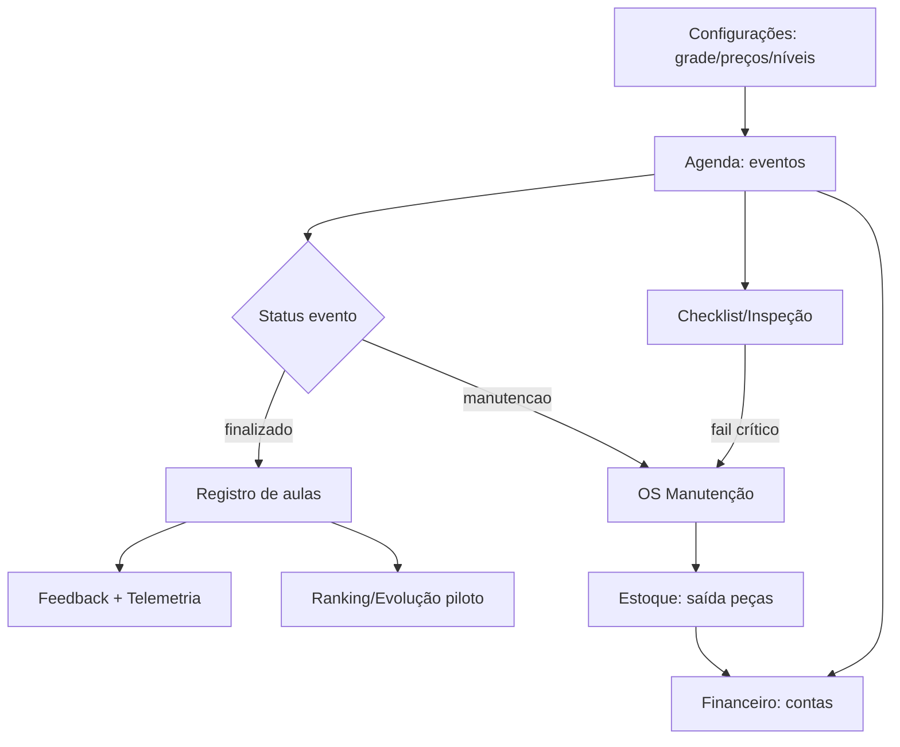

# BUSINESS_RULES — Gurgel Team

> **Última atualização:** 2026-05-28  
> **Fonte:** `lib/*-mocks.ts`, `lib/contracts/`, `repositories/`, `lib/auth/`  
> **Legenda:** `[CONFIRMADO]` = codificado em mock/repository · `[INFERIDO]` = deduzido de UI sem validação server-side  
> **Aviso:** regras existem apenas no frontend — backend não valida ainda.

---

## 1. Permissões por perfil

**Fonte principal:** `lib/admin-settings-mocks.ts`

### 1.1 Papéis operacionais (coarse-grained)

| RoleKey | verAlunos | editarAlunos | verFinanceiro | editarAgenda | publicarResultados | alterarConfiguracoes |
|---------|-----------|--------------|---------------|--------------|-------------------|---------------------|
| `admin` | ✓ | ✓ | ✓ | ✓ | ✓ | ✓ |
| `instrutor` | ✓ | ✓ | ✗ | ✓ | ✓ | ✗ |
| `recepcao` | ✓ | ✗ | ✗ | ✓ | ✗ | ✗ |
| `financeiro` | ✓ | ✗ | ✓ | ✗ | ✗ | ✗ |

### 1.2 Permissões granulares por módulo

Cada usuário tem `visualizar | editar | excluir` por `ModuleKey`:

**Módulos admin:** dashboard, agenda, registroAulas, alunos, instrutores, karts, manutencao, estoque, telemetria, campeonatos, financeiro, relatorios, configuracoes

**Módulos piloto:** pilotoDashboard, pilotoAgenda, pilotoEvolucao, pilotoFeedbacks, pilotoPlano, pilotoTelemetria, pilotoResultados, pilotoMateriais, pilotoConquistas, pilotoRanking

### 1.3 Papéis mock detalhados

| Papel | Acesso |
|-------|--------|
| **Administrador** | Todos os 22 módulos, CRUD completo |
| **Instrutor** | agenda, registroAulas, alunos (V/E), karts/manutencao (só ver), pilotoFeedbacks, pilotoPlano |
| **Mecânico** | karts, manutencao, estoque (V/E, sem excluir) |
| **Piloto** | Área piloto (só visualizar) |
| **Responsável** | alunos, agenda (só ver) + área piloto parcial |
| **Piloto menor** | Área piloto parcial (sem telemetria, plano, resultados, ranking) |

**Regra:** novos usuários começam **sem acesso** a nenhum módulo (`createSettingsUser`).

### 1.4 Enforcement

`[CONFIRMADO]` — permissões existem como **modelo mock** na UI de settings.  
`[CONFIRMADO]` — **sem middleware/guards** server-side; páginas 401/403 são estáticas.

---

## 2. Autenticação e cadastro

**Fontes:** `lib/auth-accounts-mocks.ts`, `lib/cadastro-mocks.ts`, `lib/auth/validate-auth-forms.ts`, `lib/contracts/auth/auth.schemas.ts`

| Regra | Detalhe |
|-------|---------|
| Login | Aceita e-mail **ou** username (`nome.sobrenome`, 3–29 chars, alfanumérico + ponto) |
| Conta deve existir | `findAccountByIdentifier` — senha **não é validada** (mock) |
| Username | Gerado como `nome.sobrenome`; se ocupado, adiciona sufixo numérico |
| CPF | 11 dígitos obrigatórios |
| E-mail | Formato válido obrigatório |
| Senha | Mín. 8 chars, 1 maiúscula, 1 número, 1 especial, sem espaços |
| Menor de 14 anos | **Não pode se cadastrar sozinho** — responsável ≥18 deve criar conta e vincular |
| Recuperação | Mascara e-mail para exibição; código 6 dígitos |
| Remember me | Campo presente no DTO; sem persistência real |

**Contas mock:** `piloto@gurgelteam.com.br`, `ana.silva@...` — `lib/auth-accounts-mocks.ts`

---

## 3. Configurações (Settings)

**Fonte:** `lib/admin-settings-mocks.ts`

### 3.1 Abas

geral, usuarios, horarios, precos, categorias, notificacoes, documentos

### 3.2 Horários operacionais

| Conceito | Regra |
|----------|-------|
| Grade semanal | Slots com `start/end`, `categoryId`, `levelId` |
| Programação específica | Substitui grade naquela data |
| Exceções | Bloqueiam slots por `slotIds` + motivo |
| Resolução efetiva | específica > semanal, menos exceções, ordenada por hora |
| Slot padrão | **50 min** (ex.: 08:00–08:50) |
| Calendário | Semana começa na **segunda** |

Função: `getEffectiveScheduleSlotsForDate()`

### 3.3 Preços por categoria (centavos)

| Categoria | Aula avulsa |
|-----------|-------------|
| Mirim/Cadete | R$ 280,00 |
| F400 | R$ 350,00 |
| 125cc | R$ 420,00 |

Preços sincronizam com categorias de kart (`syncCategoryPricesFromKart`).

### 3.4 Níveis de habilidade (progressão por tempo de volta)

Tempos em centésimos de segundo por categoria:

| Nível | Mirim/Cadete | F400 | 125cc |
|-------|--------------|------|-------|
| Iniciante | 0 | 0 | 0 |
| Intermediário | 62,00s | 58,00s | — |
| Avançado | 58,00s | 55,00s | 53,00s |
| Competidor | 55,00s | 52,00s | 50,00s |

### 3.5 Frota em configurações

- **Ownership:** `rental` (frota) | `client` (kart do cliente)
- Status: Disponível, Em treino, Manutenção
- Preventiva frota: intervalo por horas (25–40h); kart cliente: "Sob responsabilidade do cliente"

### 3.6 Critérios de feedback (8 dimensões)

Frenagem, tangência, aceleração, postura, consistência, controle emocional, ultrapassagem, estratégia — score padrão 3–4

### 3.7 Notificações

Canais: whatsapp, email, interna  
Eventos: confirmação, lembrete, cancelamento, feedback, resultado publicado, vencimento de pacote

### 3.8 Ranking

- Melhor volta: volta válida (sem entrada/saída)
- Consistência: desvio padrão < 0,35s nas 5 melhores voltas
- Rankings: mensal, geral, pontos de campeonato, conquistas automáticas

### 3.9 Documentos legais

| Documento | Regra |
|-----------|-------|
| Cancelamento | Até **24h** antes → crédito para reagendamento; no-show sem aviso → **não reembolsável** |
| Menor de idade | Autorização do responsável + documento no check-in |
| Regulamento | EPI homologado obrigatório; proibido álcool |
| Termo de responsabilidade | Assinatura digital antes da 1ª sessão |

---

## 4. Regras de agendamento

**Fontes:** `lib/admin-schedule-mocks.ts`, `lib/admin-new-class-mocks.ts`, `repositories/schedule/*`

### 4.1 Tipos de evento

aula_individual, aula_grupo, treino_livre, treino_avancado, telemetria, campeonato, manutencao, reserva_kart, bloqueio_pista

### 4.2 Status de evento

confirmado, pendente, em_andamento, finalizado, cancelado, reagendado, no_show, aguardando_pagamento

### 4.3 Pagamento no evento

`pago | pendente | vencido | pacote`

### 4.4 Status de kart na agenda

disponivel, reservado, em_treino, manutencao, bloqueado_checklist

### 4.5 Conflitos operacionais (detectados)

- Kart em manutenção mas reservado
- Instrutor com sobreposição de horário
- Aluno com pagamento pendente
- Limite de alunos excedido (ex.: treino avançado "Limite 8 pilotos")

### 4.6 Nova aula

| Regra | Detalhe |
|-------|---------|
| Instrutor fixo | **Gurgel** (`GURGEL_SCHEDULE_INSTRUCTOR_ID = "i1"`) |
| Slots | Derivados da grade de configurações |
| Status de slot | `available | busy | break | conflict | level_mismatch` |
| Level mismatch | Slot com `levelId` diferente do aluno → marcado, mas selecionável |
| Alertas | Horário ocupado, proximidade de sessão, carga elevada após 17h |
| Categorias | Aluno tem `allowedCategoryIds` — restringe categorias |
| Kart | rental, próprio ou terceiros |

### 4.7 Reagendamento

Slot disponível se:
1. Não bloqueado (`ScheduleBlocksRepositoryMock`)
2. Sem outro evento no horário
3. Categoria compatível com categorias permitidas do piloto

Mapeamento categoria evento → slot: cadete→mirim-cadete, competicao→f400+125cc, rental→todas

**Fonte:** `ScheduleRescheduleRepositoryMock.ts`

### 4.8 Bloqueios de pista

Bloqueio por slot ou dia inteiro; `isDateFullyBlocked` quando todos os slots estão bloqueados.

**Fonte:** `ScheduleBlocksRepositoryMock.ts`

### 4.9 Reserva pública

`[INFERIDO]` — fluxo em `/reserva` com etapas data/slot/login/confirmação; dados mock em `lib/kart-reserva-schedule.ts`

---

## 5. Regras financeiras

**Fontes:** `lib/admin-financial-mocks.ts`, `lib/admin-dre-mocks.ts`, `lib/admin-cash-flow-mocks.ts`

### 5.1 Abas

overview, receivables, payables, cashflow, dre

### 5.2 Fontes de receita

Aulas avulsas, pacotes, aluguel de kart, manutenção kart cliente, eventos/campeonatos, coaching/telemetria

### 5.3 Status de títulos (receber e pagar)

`pago | pendente | vencido | parcial`

### 5.4 Pacotes / créditos

Status: `ativo | expirando | esgotado` — controla aulas totais/usadas + validade

### 5.5 KPIs executivos

Receita, lucro, saldo, inadimplência, meta mensal (ex.: R$ 50.000), alunos ativos, aulas realizadas, karts disponíveis/em manutenção

### 5.6 Alertas executivos

| Alerta | Ação sugerida |
|--------|---------------|
| Inadimplência | Cobrar cliente |
| Pacotes com ≤2 aulas | Renovar |
| Receita abaixo da meta | Ver agenda |
| Karts parados | Abrir manutenção |

### 5.7 Rentabilidade por kart

Receita − manutenção − peças = lucro estimado; margem operacional; custo/hora

### 5.8 DRE

Estrutura: receita bruta → impostos → receita líquida → custos operacionais (combustível, pneus, manutenção, peças, pista) → lucro bruto → despesas (admin, marketing, tech, bancárias) → lucro operacional → resultado financeiro → lucro líquido

Períodos: mês atual, anterior, ano, últimos 12 meses, custom

### 5.9 Fluxo de caixa

Períodos: hoje, semana, mês, últimos 3 meses; projeção com alerta de saldo negativo

### 5.10 Formas de pagamento (distribuição mock)

Pix (52%), Cartão (28%), Dinheiro (12%), Transferência (8%)

### 5.11 Filtros

Por status, método, serviço/categoria, busca textual — `filterAccountsReceivable`, `filterAccountsPayable`

---

## 6. Regras de estoque

**Fontes:** `lib/admin-inventory-mocks.ts`, `lib/admin-parts-mocks.ts`

### 6.1 Categorias de peça

Motor, Pneus, Freio, Transmissão, Combustível, Segurança, Ferramentas, Elétrica

### 6.2 Níveis de estoque

`ok | low | critical` — cada peça tem `stock`, `minStock`, `stockLevel`

### 6.3 Tipos de movimentação

entrada, saida, ajuste, perda, devolucao — vinculados a kart/OS/responsável

### 6.4 Workflow de compras

Status: `solicitado → aprovado → comprado → entregue`

### 6.5 Estoque crítico

Previsão de ruptura por sessões restantes, consumo médio, última compra

### 6.6 Fornecedores

Status: `ativo | atrasado | inativo`; lead time médio em dias

### 6.7 Regras de saída de peça

| Condição | Resultado |
|----------|-----------|
| qty > stock | **Erro** — não pode salvar |
| stockLevel critical ou restam ≤1 após saída | Alerta crítico — solicitar reposição |
| stockLevel low ou restam ≤3 | Alerta baixo |
| OK | Sem alerta |

Função: `getStockAlert()` em `admin-parts-mocks.ts`

### 6.8 Billing de peça em OS de cliente

`ClientBillingMode`: orcamento, cobrar, interno

---

## 7. Regras de manutenção

**Fontes:** `lib/admin-maintenance-mocks.ts`, `lib/admin-checklist-mocks.ts`, `lib/admin-inspection-mocks.ts`

### 7.1 Tipos de OS

preventiva, corretiva, emergencial (+ revisao, setup, pos_incidente, pre_campeonato na criação)

### 7.2 Fluxo de status (ordem)

detectado → aguardando_analise → aguardando_peca → em_manutencao → em_testes → finalizado → liberado

### 7.3 Prioridades

baixa, media, alta, critica

### 7.4 Ownership

- **rental:** fluxo interno
- **client:** fluxo com orçamento → aprovação → execução → entrega

Passos cliente: problema detectado → orçamento → aprovação → execução → liberação

### 7.5 Peças na OS

Status: em_estoque, solicitado, aguardando, instalado

### 7.6 Liberação para pista

Requer teste em pista (`tests.performed`, `approved`, `released`)

### 7.7 Checklist

Tipos: pre, post, revisao, campeonato

**Resultado automático** (`computeInspectionSummary`):
- Item crítico com fail → **bloqueado**
- fail ou warn → **restrito**
- Caso contrário → **liberado**

Itens críticos: banco, volante, pressão/resposta freio, vazamentos, corrente, integridade pneus, chassi, trincas, vazamento combustível

### 7.8 Inspeção técnica

8 tipos (pre_treino, pos_treino, preventiva, corretiva, pre_campeonato, pos_incidente, vistoria, entrada)

**Resultado** (`computeInspectionResult`):
- Severidade crítica ou condição geral crítica → bloqueado
- fail/warn/atenção → restrito
- Score = % de itens OK

### 7.9 Origens de OS

manual, checklist, inspecao, alerta, reclamacao, pos_incidente

### 7.10 Preventiva por horas

Alertas por horas de motor restantes (óleo, revisão, pneus); karts rental têm intervalos configuráveis

---

## 8. Regras de clientes

**Fonte:** `lib/admin-clients-mocks.ts`

| Regra | Detalhe |
|-------|---------|
| Status | Ativo \| Inativo |
| Categorias/níveis | Vêm de `KART_CATEGORIES` e `SKILL_LEVELS` (settings) |
| Menor de idade | Flag `isMinor` → perfil inclui `guardian` |
| Risco de churn (`atRisk`) | Frequência "Baixa"; financeiro "atrasado"; health flags |
| Performance | Frequência Alta se consistência >85%; meta por nível |

---

## 9. Regras de karts / frota

**Fonte:** `lib/admin-karts-mocks.ts`

| Regra | Detalhe |
|-------|---------|
| Status | disponivel, em_treino, reservado, manutencao, aguardando_peca, indisponivel, preparacao, lavagem |
| Ownership | rental (próprio) \| client (guardado no paddock) |
| Motores | IAME, Rotax, Vortex ROK (catálogo registrado) |
| Filtros | Por categoria, status, ownership, janela manutenção (7/30 dias, atrasada) |

---

## 10. Regras de registro de aulas

**Fontes:** `lib/lesson-registration-mocks.ts`, `lib/contracts/lessons/`

### 10.1 Status de sessão (`LessonStatus`)

aguardando, pendente_registro, em_andamento, concluida, cancelada

### 10.2 Eventos registráveis

Exclui manutencao e eventos sem aluno

### 10.3 Mapeamento status agenda → sessão

| Status agenda | Status sessão |
|---------------|---------------|
| finalizado | pendente_registro |
| em_andamento | em_andamento |
| confirmado (hoje até 12h) | pendente_registro |
| confirmado (futuro) | aguardando |

### 10.4 Métodos de cronometragem

Manual, OCR (OpenAI), telemetria importada

### 10.5 OCR

- API: `POST /api/admin/lesson-registration/ocr`
- Requer revisão manual em cenários inconsistentes
- Modelo default: `gpt-4o`

### 10.6 Validação de voltas

Consistência de setores/tempos exigida antes de finalizar registro

---

## 11. Regras de telemetria

**Fontes:** `lib/telemetry-engine/`, `lib/contracts/telemetry/`, `lib/contracts/enums.ts`

| Regra | Detalhe |
|-------|---------|
| Status processamento | UPLOADED → PROCESSING → NORMALIZING → COMPLETED \| FAILED |
| Adapters | MyChron, Alfano, GPS genérico, GoPro |
| Pipeline | Import → normalização → laps → setores → ideal lap → qualidade |
| Storage | Client-side (`session-store.ts`, `user-track-store.ts`) |
| Consentimento | `ConsentStatus`: ACCEPTED \| REVOKED \| PENDING |

---

## 12. Regras de relatórios

**Fonte:** `lib/admin-financial-mocks.ts` (`FINANCIAL_REPORTS`)

| ID | Relatório |
|----|-----------|
| daily | Receita diária |
| monthly | Receita mensal |
| service | Receita por serviço |
| client | Receita por cliente |
| kart | Receita por kart |
| costs | Custos operacionais |
| delinq | Inadimplência |
| cashflow | Fluxo de caixa |

**Nota:** módulo "Relatórios" (`ModuleKey: relatorios`) existe na navegação, mas **sem mock dedicado** além dos financeiros acima.

---

## 13. Fluxos operacionais (diagrama)

---

## 14. Consentimentos e perfil

**Fontes:** `lib/contracts/consents/`, `lib/student-profile-mocks.ts`

| Regra | Detalhe |
|-------|---------|
| Tipos | Termos de uso, privacidade, uso de imagem |
| Aceite/revogação | UI presente; sem trilha de auditoria backend |
| Papéis de conta | titular, responsável, piloto vinculado (`AccountRole`) |
| Switcher de perfil | UI only; sem enforcement server-side |
