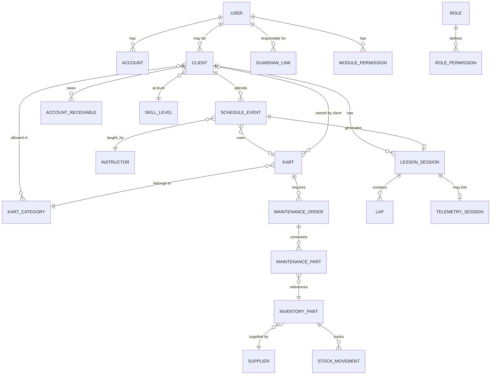

# DATABASE_REFERENCE — Gurgel Team

> **Última atualização:** 2026-05-28  
> **Aviso crítico:** **Não existe banco de dados implementado** `[CONFIRMADO]`. Sem Prisma, Drizzle, SQL ou migrations.  
> Este documento descreve o **modelo lógico de dados** inferido dos contratos (`lib/contracts/`) e mocks (`lib/*-mocks.ts`) como referência para implementação futura do backend.  
> **Legenda:** `[CONFIRMADO]` = tipo/campo explícito no código · `[INFERIDO]` = relacionamento deduzido · `[PLANEJADO]` = necessário mas não modelado

---

## 1. Visão geral

| Aspecto | Estado atual |
|---------|--------------|
| ORM / DB | Ausente |
| Persistência | Mocks in-memory + 5 stores locais |
| Contratos | `lib/contracts/` — DTOs TypeScript + Zod parcial |
| IDs | Strings mock (ex.: `"c1"`, `"i1"`) — não UUID |
| Timestamps | Opcionais em DTOs (`createdAt?`, `updatedAt?`) |

### Stores locais (não-banco)

| Store | Arquivo | Escopo |
|-------|---------|--------|
| Registro de aulas | `lib/lesson-registration-store.ts` | Memória |
| Peças estoque | `lib/inventory-parts-store.ts` | Memória |
| Fornecedores | `lib/inventory-suppliers-store.ts` | Memória |
| Sessões telemetria | `lib/telemetry-engine/storage/session-store.ts` | Browser |
| Pistas usuário | `lib/telemetry-engine/tracks/user-track-store.ts` | Browser |

---

## 2. Diagrama de relacionamentos (modelo lógico)



---

## 3. Entidades

### 3.1 USER / ACCOUNT (Auth)

**Fonte:** `lib/contracts/auth/auth.types.ts`, `lib/auth-accounts-mocks.ts`

| Campo | Tipo | Obrigatório | Notas |
|-------|------|-------------|-------|
| id | string | ✓ | `[INFERIDO]` |
| firstName | string | ✓ | Cadastro |
| lastName | string | ✓ | Cadastro |
| email | string | ✓ | Único |
| username | string | ✓ | `nome.sobrenome` |
| cpf | string | ✓ | 11 dígitos |
| birthDate | string (ISO) | ✓ | |
| passwordHash | string | ✓ | `[PLANEJADO]` — mock não valida senha |
| role | RoleKey | ✓ | admin, instrutor, recepcao, financeiro |
| remember | boolean | — | Login DTO only |

**Relacionamentos:**
- 1:N → MODULE_PERMISSION
- 1:1 ou 1:N → CLIENT (piloto vinculado)
- 1:N → CONSENT (aceites)

---

### 3.2 CLIENT (Aluno/Piloto)

**Fonte:** `lib/admin-clients-mocks.ts`, `lib/contracts/clients/index.ts`

| Campo | Tipo | Obrigatório | Notas |
|-------|------|-------------|-------|
| id | string | ✓ | |
| name | string | ✓ | |
| avatar | string | — | URL |
| categoryIds | string[] | ✓ | FK → KART_CATEGORY |
| levelId | string | ✓ | FK → SKILL_LEVEL |
| status | ClientStatus | ✓ | Ativo \| Inativo |
| lastSession | string | — | Data display |
| nextSession | string | — | Data display |
| phone | string | — | Perfil |
| email | string | — | |
| isMinor | boolean | — | Trigger guardian |
| atRisk | boolean | — | Calculado |
| frequency | string | — | Alta/Média/Baixa |
| financialStatus | string | — | |
| pendingAmount | string | — | |
| consistency | number | — | % |
| bestLap | string | — | |
| totalSessions | number | — | |
| memberSince | string | — | |

**CLIENT_GUARDIAN** (embedded ou tabela):

| Campo | Tipo |
|-------|------|
| name | string |
| phone | string |
| email | string |
| authorizationSigned | boolean |
| documentsOnFile | boolean |

**Relacionamentos:**
- N:M → KART_CATEGORY (via categoryIds)
- N:1 → SKILL_LEVEL
- 1:N → SCHEDULE_EVENT, LESSON_SESSION, ACCOUNT_RECEIVABLE
- 1:1 → GUARDIAN (se isMinor)

---

### 3.3 KART

**Fonte:** `lib/admin-karts-mocks.ts`, `lib/contracts/karts/index.ts`

| Campo | Tipo | Obrigatório | Notas |
|-------|------|-------------|-------|
| id | string | ✓ | |
| number | number | ✓ | Número do kart |
| categoryId | string | ✓ | FK → KART_CATEGORY |
| ownership | KartOwnership | ✓ | rental \| client |
| clientId | string | — | Se ownership=client |
| status | KartStatus | ✓ | 8 valores |
| motor | string | — | ID motor registrado |
| engineHours | number | — | |
| lastMaintenanceDate | string | — | ISO |
| nextMaintenanceHours | number | — | Preventiva |
| totalSessions | number | — | |
| revenue | string | — | Display |

**KartStatus:** disponivel, em_treino, reservado, manutencao, aguardando_peca, indisponivel, preparacao, lavagem

---

### 3.4 KART_CATEGORY / SKILL_LEVEL

**Fonte:** `lib/admin-settings-mocks.ts`

**KART_CATEGORY:**

| Campo | Tipo |
|-------|------|
| id | string |
| name | string |
| description | string |
| pricePerLesson | number (centavos) |
| active | boolean |

**SKILL_LEVEL:**

| Campo | Tipo |
|-------|------|
| id | string |
| name | string |
| lapTimeThresholds | Record<categoryId, number> |

---

### 3.5 SCHEDULE_EVENT

**Fonte:** `lib/admin-schedule-mocks.ts`, `lib/contracts/schedule/index.ts`

| Campo | Tipo | Obrigatório | Notas |
|-------|------|-------------|-------|
| id | string | ✓ | |
| date | string | ✓ | ISO date |
| start | string | ✓ | HH:mm |
| end | string | ✓ | HH:mm |
| type | ScheduleEventType | ✓ | 9 tipos |
| status | ScheduleEventStatus | ✓ | 8 status |
| studentId | string | — | FK → CLIENT |
| studentName | string | — | Denormalizado |
| instructorId | string | — | FK → INSTRUCTOR |
| kartId | string | — | FK → KART |
| kartNumber | number | — | Denormalizado |
| categoryId | string | — | |
| paymentStatus | PaymentStatus | — | pago/pendente/vencido/pacote |
| notes | string | — | |
| maxStudents | number | — | Treinos em grupo |

**ScheduleEventType:** aula_individual, aula_grupo, treino_livre, treino_avancado, telemetria, campeonato, manutencao, reserva_kart, bloqueio_pista

---

### 3.6 SCHEDULE_BLOCK

**Fonte:** `repositories/schedule/ScheduleBlocksRepositoryMock.ts`

| Campo | Tipo |
|-------|------|
| id | string |
| date | string |
| slotIds | string[] |
| reason | string |
| fullDay | boolean |

---

### 3.7 LESSON_SESSION

**Fonte:** `lib/contracts/lessons/lesson.types.ts`

| Campo | Tipo | Obrigatório |
|-------|------|-------------|
| id | string | ✓ |
| scheduleEventId | string | ✓ |
| date | string | ✓ |
| start | string | ✓ |
| end | string | ✓ |
| studentName | string | ✓ |
| studentId | string | — |
| avatar | string | — |
| category | string | ✓ |
| typeLabel | string | ✓ |
| instructorName | string | ✓ |
| kartNumber | number | ✓ |
| status | LessonStatus | ✓ |
| objective | string | — |
| previousNote | string | — |
| createdAt | string | — |
| updatedAt | string | — |

**LessonStatus:** aguardando, pendente_registro, em_andamento, concluida, cancelada

**Relacionamentos:**
- N:1 → SCHEDULE_EVENT
- 1:N → LAP (voltas registradas)
- 1:N → FEEDBACK (8 dimensões)

---

### 3.8 MAINTENANCE_ORDER

**Fonte:** `lib/admin-maintenance-mocks.ts`, `lib/contracts/maintenance/index.ts`

| Campo | Tipo |
|-------|------|
| id | string |
| kartId | string |
| kartNumber | number |
| type | MaintenanceType |
| status | MaintenanceStatus |
| priority | MaintenancePriority |
| ownership | KartOwnership |
| origin | string |
| description | string |
| detectedAt | string |
| assignedTo | string |
| estimatedHours | number |
| clientFlow | object | Se ownership=client |

**MaintenanceStatus (ordem):** detectado → aguardando_analise → aguardando_peca → em_manutencao → em_testes → finalizado → liberado

**MAINTENANCE_PART:**

| Campo | Tipo |
|-------|------|
| partId | string |
| name | string |
| qty | number |
| status | em_estoque/solicitado/aguardando/instalado |
| billingMode | orcamento/cobrar/interno |

---

### 3.9 CHECKLIST / INSPECTION

**Fontes:** `lib/admin-checklist-mocks.ts`, `lib/admin-inspection-mocks.ts`

**CHECKLIST:**

| Campo | Tipo |
|-------|------|
| id | string |
| kartId | string |
| type | pre/post/revisao/campeonato |
| items | ChecklistItem[] |
| result | liberado/restrito/bloqueado |
| performedBy | string |
| performedAt | string |

**INSPECTION:** estrutura similar com 8 tipos, severidade por item, score %

---

### 3.10 INVENTORY_PART

**Fonte:** `lib/contracts/inventory/inventory.types.ts`

| Campo | Tipo | Obrigatório |
|-------|------|-------------|
| id | string | ✓ |
| code | string | ✓ |
| name | string | ✓ |
| category | string | ✓ |
| stock | number | ✓ |
| minStock | number | ✓ |
| unitCost | number | ✓ |
| supplierId | string | ✓ |
| supplierName | string | ✓ |
| stockLevel | ok/low/critical | — |
| createdAt | string | — |
| updatedAt | string | — |

**SUPPLIER:**

| Campo | Tipo |
|-------|------|
| id | string |
| code | string |
| name | string |
| cnpj | string |
| city | string |
| phone | string |
| whatsapp | string |
| email | string |
| status | ativo/atrasado/inativo |
| avgLeadDays | number |
| partsSupplied | string[] |
| lastPurchase | string |

**STOCK_MOVEMENT** `[INFERIDO]`:

| Campo | Tipo |
|-------|------|
| id | string |
| partId | string |
| type | entrada/saida/ajuste/perda/devolucao |
| qty | number |
| kartId | string |
| orderId | string |
| responsibleId | string |
| createdAt | string |

**PURCHASE_ORDER** `[INFERIDO]`:

| Campo | Tipo |
|-------|------|
| id | string |
| status | solicitado/aprovado/comprado/entregue |
| supplierId | string |
| items | PartLine[] |

---

### 3.11 FINANCEIRO

**Fonte:** `lib/contracts/finance/finance.types.ts`

**ACCOUNT_RECEIVABLE:**

| Campo | Tipo |
|-------|------|
| id | string |
| clientId | string |
| clientName | string |
| amount | string |
| dueDate | string |
| status | pago/pendente/vencido/parcial |
| paymentMethod | string |
| service | string |

**ACCOUNT_PAYABLE:**

| Campo | Tipo |
|-------|------|
| id | string |
| supplierName | string |
| category | string |
| amount | string |
| dueDate | string |
| status | ReceivableStatus |
| paymentMethod | string |

**PACKAGE** `[INFERIDO]`:

| Campo | Tipo |
|-------|------|
| id | string |
| clientId | string |
| totalLessons | number |
| usedLessons | number |
| expiresAt | string |
| status | ativo/expirando/esgotado |

**DRE_ENTRY** `[INFERIDO]` — estrutura hierárquica em `admin-dre-mocks.ts`:
- accountCode, label, level, amount, children[]

---

### 3.12 TELEMETRY_SESSION

**Fonte:** `lib/contracts/telemetry/telemetry.types.ts`, `lib/telemetry-engine/`

| Campo | Tipo |
|-------|------|
| id | string |
| status | TelemetryStatus |
| source | mychron/alfano/gps/gopro |
| trackId | string |
| laps | Lap[] |
| sectors | Sector[] |
| idealLap | Lap |
| studentId | string |
| lessonSessionId | string |
| processedAt | string |

**TelemetryStatus:** UPLOADED, PROCESSING, NORMALIZING, COMPLETED, FAILED

---

### 3.13 SETTINGS / CONFIG

**Fonte:** `lib/admin-settings-mocks.ts`

**GENERAL_SETTINGS:** teamName, logo, cnpj, email, whatsapp, address, redes sociais, institutionalText

**WEEK_SCHEDULE_SLOT:** dayOfWeek, start, end, categoryId, levelId

**SCHEDULE_EXCEPTION:** date, slotIds[], reason

**NOTIFICATION_CONFIG:** eventType, channels[], template

**LEGAL_DOCUMENT:** type, content, version, requiredBeforeSession

---

### 3.14 PERMISSIONS

**MODULE_PERMISSION:**

| Campo | Tipo |
|-------|------|
| userId | string |
| moduleKey | ModuleKey |
| view | boolean |
| create | boolean |
| edit | boolean |
| delete | boolean |

22 ModuleKeys documentados em `admin-settings-mocks.ts`.

---

### 3.15 CONSENT

**Fonte:** `lib/contracts/consents/consent.types.ts`

| Campo | Tipo |
|-------|------|
| userId | string |
| type | terms/privacy/image |
| status | ACCEPTED/REVOKED/PENDING |
| acceptedAt | string |
| revokedAt | string |
| version | string |

---

## 4. Tabelas sugeridas (implementação futura)

`[INFERIDO]` — mapeamento lógico → SQL relacional sugerido:

| Tabela | Entidade | PK |
|--------|----------|-----|
| users | USER | id (UUID) |
| clients | CLIENT | id |
| client_guardians | GUARDIAN | id |
| client_categories | N:M client↔category | composite |
| karts | KART | id |
| kart_categories | KART_CATEGORY | id |
| skill_levels | SKILL_LEVEL | id |
| schedule_events | SCHEDULE_EVENT | id |
| schedule_blocks | SCHEDULE_BLOCK | id |
| lesson_sessions | LESSON_SESSION | id |
| lesson_laps | LAP | id |
| lesson_feedbacks | FEEDBACK | id |
| maintenance_orders | MAINTENANCE_ORDER | id |
| maintenance_parts | MAINTENANCE_PART | id |
| checklists | CHECKLIST | id |
| inspections | INSPECTION | id |
| inventory_parts | INVENTORY_PART | id |
| suppliers | SUPPLIER | id |
| stock_movements | STOCK_MOVEMENT | id |
| purchase_orders | PURCHASE_ORDER | id |
| accounts_receivable | ACCOUNT_RECEIVABLE | id |
| accounts_payable | ACCOUNT_PAYABLE | id |
| packages | PACKAGE | id |
| telemetry_sessions | TELEMETRY_SESSION | id |
| module_permissions | MODULE_PERMISSION | composite |
| consents | CONSENT | id |
| settings_general | singleton | id |
| week_schedule_slots | SLOT | id |
| schedule_exceptions | EXCEPTION | id |

---

## 5. Campos importantes (índices sugeridos)

`[INFERIDO]` — para performance em queries esperadas pela UI:

| Tabela | Índice | Motivo |
|--------|--------|--------|
| schedule_events | (date, start) | Timeline/calendário |
| schedule_events | (student_id, date) | Histórico aluno |
| schedule_events | (instructor_id, date, start) | Conflito instrutor |
| schedule_events | (kart_id, date, start) | Disponibilidade kart |
| lesson_sessions | (schedule_event_id) | 1:1 lookup |
| lesson_sessions | (status, date) | Filtro registro aulas |
| clients | (status) | Filtro CRM |
| clients | (level_id) | Filtro nível |
| karts | (status, ownership) | Frota/paddock |
| maintenance_orders | (kart_id, status) | OS abertas |
| inventory_parts | (stock_level) | Alertas estoque |
| accounts_receivable | (status, due_date) | Inadimplência |
| accounts_payable | (status, due_date) | Vencimentos |
| module_permissions | (user_id) | AuthZ |
| consents | (user_id, type) | Verificação aceite |

---

## 6. Regras de integridade

`[CONFIRMADO]` — regras de negócio que devem ser constraints no backend:

| Regra | Tabelas | Tipo |
|-------|---------|------|
| Menor 14 anos exige guardian | clients, client_guardians | CHECK / FK |
| stock ≥ 0 | inventory_parts | CHECK |
| Saída peça ≤ stock | stock_movements | TRIGGER |
| Evento não sobrepõe kart no mesmo slot | schedule_events | UNIQUE / TRIGGER |
| Evento não sobrepõe instrutor | schedule_events | TRIGGER |
| lesson_session.schedule_event_id único | lesson_sessions | UNIQUE |
| Kart client exige client_id | karts | CHECK |
| Consent required before 1ª sessão | consents, lesson_sessions | TRIGGER |
| OS liberada exige teste aprovado | maintenance_orders | CHECK |
| Checklist crítico fail → kart bloqueado | checklists, karts | TRIGGER |
| package.used_lessons ≤ total_lessons | packages | CHECK |
| CPF único | users | UNIQUE |
| Email único | users | UNIQUE |
| Username único | users | UNIQUE |

---

## 7. Enums centralizados

**Fonte:** `lib/contracts/enums.ts`

```typescript
LessonStatus: aguardando | pendente_registro | em_andamento | concluida | cancelada
TelemetryStatus: UPLOADED | PROCESSING | NORMALIZING | COMPLETED | FAILED
ConsentStatus: ACCEPTED | REVOKED | PENDING
```

Demais enums estão dispersos nos mocks — consolidar no backend.

---

## 8. API Response padrão

**Fonte:** `lib/contracts/api/api-response.ts`

```typescript
ApiResponse<T> = { success: true, data: T } | { success: false, error: ApiError }
```

Usado nas rotas `/api/admin/schedule/*`.

---

## 9. Gaps do modelo atual

| Gap | Impacto |
|-----|---------|
| IDs string não estáveis | Migração difícil |
| Denormalização (studentName, kartNumber) | Sync issues |
| Sem timestamps consistentes | Auditoria impossível |
| Permissões duplicadas (coarse + granular) | Unificar schema |
| Telemetria só client-side | Persistência pendente |
| Sem soft delete | `[PLANEJADO]` |
| Sem audit log | `[PLANEJADO]` |
