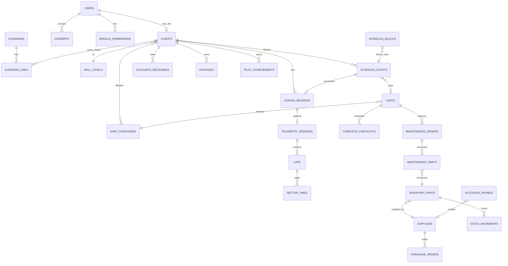
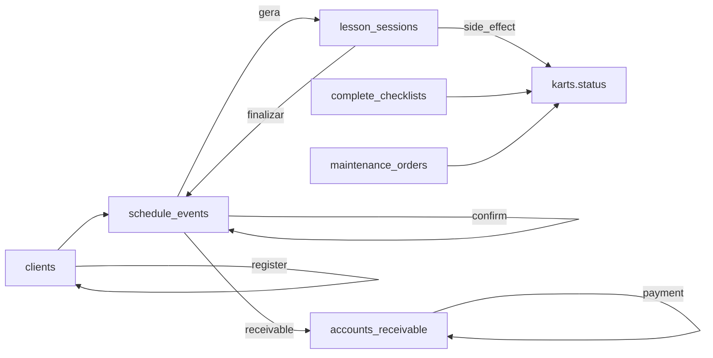

# ENTITY_CATALOG — Catálogo de entidades (Fase 2)

> **Status:** `[CONFIRMADO v1]` — 2026-05-28  
> **Objetivo:** inventário lógico **completo** do domínio Gurgel Team, independente do que já está mockado.  
> **Complementa:** `DATABASE_REFERENCE.md` (campos detalhados) · **Alimenta:** Fase 3 (`schema.prisma`), Fase 4 (`API_SPEC.md`)

**Legenda de evidência**

| Tag | Significado |
|-----|-------------|
| `[CONFIRMADO]` | Tipo/campo explícito em `lib/contracts/` ou mock usado na UI |
| `[INFERIDO]` | Relacionamento ou campo deduzido; ainda não persistido |
| `[PLANEJADO]` | Necessário ao negócio; sem mock nem contrato |

**Legenda de persistência atual**

| Tag | Significado |
|-----|-------------|
| `[MOCK]` | Dados estáticos em `lib/*-mocks.ts` |
| `[RUNTIME]` | Store em memória na sessão (`*-runtime-store.ts`) |
| `[LOCAL]` | Browser storage (telemetria) |
| `[AUSENTE]` | Só documentado aqui |

---

## Índice por domínio

| # | Domínio | Entidades | Seção |
|---|---------|-----------|-------|
| 1 | Identidade & acesso | users, accounts, sessions, password_resets, consents | §1 |
| 2 | Piloto & responsável | clients, guardians, guardian_links, pilot_profiles | §2 |
| 3 | Operacional | schedule_events, schedule_blocks, lesson_sessions | §3 |
| 4 | Frota | karts, kart_categories, kart_assignments | §4 |
| 5 | Manutenção | maintenance_orders, inspections, checklists, maintenance_parts | §5 |
| 6 | Estoque | inventory_parts, suppliers, stock_movements, purchase_orders | §6 |
| 7 | Financeiro | accounts_receivable, accounts_payable, payments, packages, dre_entries | §7 |
| 8 | Telemetria | telemetry_sessions, laps, sectors, tracks, telemetry_uploads | §8 |
| 9 | Mídia & documentos | video_materials, image_authorizations, legal_documents, avatars | §9 |
| 10 | Gamificação | achievements, pilot_achievements, rankings | §10 |
| 11 | Configuração | settings, week_schedule_slots, schedule_exceptions, notification_configs | §11 |
| 12 | Permissões & auditoria | roles, module_permissions, audit_logs | §12 |
| 13 | Relatórios | report_definitions, report_runs | §13 |

---

## §1 — Identidade & acesso

### `users` `[CONFIRMADO]` `[MOCK]`

Conta de login do sistema (staff ou piloto/responsável).

| Campo chave | Tipo | Notas |
|-------------|------|-------|
| id | UUID | Hoje string mock |
| email | string | Único |
| username | string | `nome.sobrenome` |
| password_hash | string | `[PLANEJADO]` — mock não valida |
| role_key | RoleKey | admin, recepcao, financeiro, mecanico |
| client_id | FK? | Se usuário é piloto vinculado |

**Fonte:** `lib/contracts/auth/auth.types.ts`, `lib/auth-accounts-mocks.ts`  
**Regras:** `BR-AUTH-*` em `BUSINESS_RULES.md` · `AUTH_SPEC.md`

### `sessions` / `password_resets` `[CONFIRMADO]` `[SCHEMA v1]`

Sessões server-side e tokens de recuperação de senha.

| Modelo Prisma | Notas |
|---------------|-------|
| `Session` | token_hash, expires_at, remember_me |
| `PasswordReset` | code_hash, used_at |

**Runtime:** ainda mock — implementação Fase 5.

### `password_resets` (fluxo UI) `[CONFIRMADO]` `[MOCK parcial]`

Fluxo recuperar-senha: identificador → código 6 dígitos → nova senha.

**Fonte:** `components/password-recovery/*`, `lib/contracts/auth/auth.types.ts`

### `consents` `[CONFIRMADO]` `[MOCK]`

Aceites legais versionados por usuário.

| Campo | Tipo |
|-------|------|
| user_id | FK → users |
| type | terms \| privacy \| image |
| status | ACCEPTED \| REVOKED \| PENDING |
| version | string |
| accepted_at / revoked_at | timestamp |

**Fonte:** `lib/contracts/consents/consent.types.ts` · `ConsentType`, `ConsentStatus` em `lib/contracts/enums.ts`

---

## §2 — Piloto & responsável

> **Nomenclatura:** ver `docs/NOMENCLATURE.md` — entidade `clients`; admin **Cliente**; portal **Piloto**.

### `clients` `[CONFIRMADO]` `[MOCK]` + `[RUNTIME]`

Piloto/aluno cadastrado na operação.

| Campo chave | Tipo | Notas |
|-------------|------|-------|
| id | string | |
| user_id | FK? | Conta de acesso do piloto |
| name, phone, email | string | |
| birth_date | date | Menor → exige guardian |
| category_ids | FK[] | kart_categories permitidas |
| level_id | FK | skill_levels |
| status | Ativo \| Inativo | |
| is_minor | boolean | |
| financial_status | string | Denormalizado para UI |

**Fonte:** `lib/admin-clients-mocks.ts`, `lib/clients-runtime-store.ts`, `lib/contracts/clients/`  
**Relacionamentos:** ver diagrama §Relacionamentos

### `guardians` / `guardian_links` `[CONFIRMADO]` `[MOCK]`

Responsável legal por piloto menor.

| Entidade | Cardinalidade |
|----------|---------------|
| guardian | 1 registro por responsável |
| guardian_link | N:M responsável ↔ pilotos (client_id) |

**Fonte:** `lib/contracts/student/profile.ts`, perfil demo `responsavel` / `menor`

### `pilot_profiles` `[INFERIDO]` `[MOCK]`

Extensão de preferências, avatar, emergência, termos — hoje embedded no perfil piloto.

**Fonte:** `lib/contracts/student/profile.ts`, `services/student/studentProfileServiceMock.ts`

---

## §3 — Operacional

### `schedule_events` `[CONFIRMADO]` `[MOCK]` + `[RUNTIME]`

Evento na agenda (aula, treino, manutenção, bloqueio).

| Campo chave | Tipo |
|-------------|------|
| id, date, start, end | |
| type | ScheduleEventType (9 valores) |
| status | ScheduleEventStatus (8 valores) |
| student_id, registrado_por, kart_id | FK |
| category_id | FK |
| payment_status | pago \| pendente \| vencido \| pacote |

**Fonte:** `lib/admin-schedule-mocks.ts`, `lib/schedule-runtime-store.ts`, `lib/contracts/schedule/`  
**API parcial:** `app/api/admin/schedule/*`

### `schedule_blocks` `[CONFIRMADO]` `[MOCK]`

Bloqueio de slot ou dia inteiro na grade.

**Fonte:** `repositories/schedule/ScheduleBlocksRepositoryMock.ts`

### `lesson_sessions` `[CONFIRMADO]` `[MOCK]` + `[RUNTIME parcial]`

Sessão operacional derivada do evento — registro de aulas, OCR, feedback.

| Campo chave | Tipo |
|-------------|------|
| id | |
| schedule_event_id | FK (obrigatório) |
| status | LessonStatus |
| registered_by_name | string — staff que registrou/avaliou |
| kart_number, student_id | |

**Fonte:** `lib/contracts/lessons/`, `lib/lesson-registration-mocks.ts`, `lib/lesson-registration-store.ts`  
**Regra:** evento `finalizado` → sessão `pendente_registro` → `concluida`

### Entidades `[PLANEJADO]` (operacional)

| Entidade | Uso |
|----------|-----|
| `feedbacks` | 8 dimensões por sessão (hoje embedded em perfil) |
| `lesson_laps` | Voltas manuais/OCR por sessão |

> Relatórios operacionais: **§13** (`OPERATIONAL_REPORTS_SPEC.md`) — domínio planejado; só `ModuleKey` em settings.

---

## §4 — Frota

### `karts` `[CONFIRMADO]` `[MOCK]` + `[RUNTIME]`

| Campo chave | Tipo |
|-------------|------|
| id, number | |
| category_id | FK |
| ownership | rental \| client |
| client_id | FK? (kart do cliente) |
| status | KartStatus (8 valores) |
| engine_hours, motor_id | |

**Fonte:** `lib/admin-karts-mocks.ts`, `lib/karts-runtime-store.ts`, `lib/contracts/karts/`

### `kart_categories` `[CONFIRMADO]` `[MOCK]`

Mirim/Cadete, F400, 125cc — preço por aula, ativo/inativo.

**Fonte:** `lib/admin-settings-mocks.ts`

### `skill_levels` `[CONFIRMADO]` `[MOCK]`

Progressão por tempo de volta por categoria.

**Fonte:** `lib/admin-settings-mocks.ts`

---

## §5 — Manutenção

### `maintenance_orders` `[CONFIRMADO]` `[MOCK]`

OS completa (fluxo legado + simple).

**Status longo:** detectado → … → liberado  
**Fonte:** `lib/admin-maintenance-mocks.ts`, `lib/contracts/maintenance/`

### `simple_maintenances` / `simple_inspections` `[CONFIRMADO]` `[MOCK]`

Fluxo operacional simplificado em `/admin/manutencao`.

**Fonte:** `lib/contracts/maintenance/simple.ts`

### `complete_checklists` `[CONFIRMADO]` `[MOCK]`

Checklist técnico pré-evento / revisão — status final aprovado/reprovado.

**Fonte:** `lib/contracts/maintenance/complete-checklist.ts`  
**Side effect mock:** aprovado → kart disponível; reprovado → manutencao (`karts-runtime-store`)

### `maintenance_parts` `[CONFIRMADO]` `[MOCK]`

Peças consumidas na OS — billing_mode: orcamento \| cobrar \| interno.

---

## §6 — Estoque

### `inventory_parts` `[CONFIRMADO]` `[MOCK]` + `[RUNTIME parcial]`

**Fonte:** `lib/admin-inventory-mocks.ts`, `lib/inventory-parts-store.ts`

### `suppliers` `[CONFIRMADO]` `[MOCK]` + `[RUNTIME parcial]`

**Fonte:** `lib/inventory-suppliers-store.ts`

### `stock_movements` `[INFERIDO]` `[MOCK UI]`

entrada \| saida \| ajuste \| perda \| devolucao — vinculado a kart/OS.

### `purchase_orders` `[INFERIDO]` `[MOCK]`

Workflow: solicitado → aprovado → comprado → entregue.

---

## §7 — Financeiro

### `accounts_receivable` `[CONFIRMADO]` `[MOCK]` + `[RUNTIME]`

**Fonte:** `lib/admin-financial-mocks.ts`, `lib/finance-runtime-store.ts`

### `accounts_payable` `[CONFIRMADO]` `[MOCK]`

### `payments` `[INFERIDO]` `[MOCK UI]`

Registro de pagamento avulso — hoje atualiza receivable em runtime.

**Fonte:** `components/admin/financial/payment-drawer.tsx`

### `packages` / `package_credits` `[CONFIRMADO]` `[MOCK]`

Pacotes de aulas: ativo \| expirando \| esgotado.

**Fonte:** `lib/admin-financial-mocks.ts` (`PACKAGE_CREDITS`)

### `cash_flow_entries` / `dre_entries` `[CONFIRMADO]` `[MOCK]`

Agregados para relatórios — estrutura hierárquica DRE.

**Fonte:** `lib/admin-dre-mocks.ts`, `lib/admin-cash-flow-mocks.ts`

### `billing_documents` `[PLANEJADO]` `[AUSENTE]`

NF-e, recibos, comprovantes anexos.

---

## §8 — Telemetria

### `telemetry_sessions` `[CONFIRMADO]` `[LOCAL]`

| Campo | Tipo |
|-------|------|
| id, status | TelemetryStatus |
| source | mychron \| alfano \| gps \| gopro |
| track_id, lesson_session_id, student_id | FK |
| laps[], sectors[] | embedded |

**Fonte:** `lib/contracts/telemetry/`, `lib/telemetry-engine/storage/session-store.ts`

### `tracks` / `track_sectors` `[CONFIRMADO]` `[LOCAL]`

Pistas e setores — editor em `/telemetria/setores`.

**Fonte:** `lib/telemetry-engine/tracks/`, `lib/contracts/telemetry/sectors.ts`

### `telemetry_uploads` `[PLANEJADO]` `[AUSENTE]`

Metadados de arquivo bruto antes do parse (S3 + job async).

---

## §9 — Mídia & documentos

### `video_materials` `[CONFIRMADO]` `[MOCK]`

Materiais do dashboard piloto.

**Fonte:** `lib/student-area-mocks.ts`

### `image_authorizations` `[PLANEJADO]` `[INFERIDO]`

Revogação de uso de imagem → bloqueio operacional (`BR-CONSENT-IMG`).

### `legal_documents` `[CONFIRMADO]` `[MOCK]`

Termos, regulamento, cancelamento — versionados em settings.

**Fonte:** `lib/admin-settings-mocks.ts`

### `avatars` `[INFERIDO]`

URL + user_id/client_id — upload futuro blob storage.

---

## §10 — Gamificação

### `achievements` `[CONFIRMADO]` `[MOCK]`

Catálogo de conquistas (definição).

**Fonte:** `lib/student-area-mocks.ts` (`ACHIEVEMENTS`)

### `pilot_achievements` `[INFERIDO]` `[MOCK]`

Conquistas desbloqueadas por piloto — hoje lista no perfil cliente.

**Fonte:** `lib/admin-clients-mocks.ts` (`ClientAchievement`)

### `rankings` `[CONFIRMADO]` `[MOCK]`

Mensal, geral — `EvolutionRanking` admin, seção resultados piloto.

---

## §11 — Configuração

### `settings` (singleton) `[CONFIRMADO]` `[MOCK]`

general, horários, preços, categorias, notificações, documentos.

**Fonte:** `lib/admin-settings-mocks.ts`, `lib/contracts/settings/`

### `week_schedule_slots` / `schedule_exceptions` `[CONFIRMADO]` `[MOCK]`

Grade semanal + exceções por data.

### `notification_configs` `[CONFIRMADO]` `[MOCK]`

Evento × canal (whatsapp, email, interna).

---

## §12 — Permissões & auditoria

### `roles` / `module_permissions` `[CONFIRMADO]` `[MOCK]`

21 `ModuleKey` admin + piloto; permissões visualizar/editar/excluir.

**Fonte:** `lib/admin-settings-mocks.ts` · Ver `PERMISSIONS_MATRIX.md`

### `audit_logs` `[CONFIRMADO]` `[SCHEMA v1]`

Modelo `AuditLog` em `prisma/schema.prisma`. Persistência e UI admin → Fase 5–6.

Ver `AUDIT_LOG_SPEC.md` · Zod: `lib/contracts/api/v1/audit.api.schemas.ts`

---

## §13 — Relatórios

> **Spec:** `OPERATIONAL_REPORTS_SPEC.md` · **Contratos:** `lib/contracts/reports/`  
> **UI admin:** **inexistente** — apenas `ModuleKey: relatorios` em configurações/permissões

### `report_definitions` `[PLANEJADO]` `[AUSENTE UI]`

Catálogo alvo: 6 operacionais + 8 financeiros (espelho) + 1 auditoria.

**Fonte:** `lib/contracts/reports/report-definitions.ts` (constantes TypeScript, spec Fase 2)  
**Não confundir com:** mocks de tela — não há rota `/admin/relatorios`

### `report_runs` `[CONFIRMADO]` `[SCHEMA v1]`

Execução assíncrona: período, status, arquivo gerado, usuário. Modelo `ReportRun` no Prisma; job → `ASYNC_JOBS.md`.

**Relatórios financeiros na UI:** aba **Relatórios** em `/admin/financeiro?tab=reports` (`financial-reports-section.tsx`).

---

## Relacionamentos

### Cardinalidades textuais

| De | Para | Cardinalidade | Notas |
|----|------|---------------|-------|
| Responsável | Piloto | 1:N | via `guardian_links` |
| Piloto | Evento agenda | 1:N | `student_id`; eventos sem aluno = manutenção/bloqueio |
| Evento | Sessão registro | 1:0..1 | Criada ao confirmar/finalizar; OCR na sessão |
| Sessão | Telemetria | 1:0..1 | Opcional; invalidação exclui stats |
| Kart | Evento | 1:N | Não simultâneo — regra de conflito |
| Kart | OS manutenção | 1:N | Status kart deriva da OS/checklist |
| Peça estoque | Movimentação | 1:N | Audit trail de qty |
| Cliente | Recebível | 1:N | Origem agendamento/pacote/manual |
| Pacote | Evento | 1:N | Débito de crédito ao agendar |

### Encadeamento operacional (runtime mock)

**Fonte runtime:** `schedule-runtime-store`, `clients-runtime-store`, `karts-runtime-store`, `finance-runtime-store`, `operational-side-effects.ts`

---

## Mapa entidade → código

| Entidade | Contrato | Mock / store | Repository |
|----------|----------|--------------|------------|
| schedule_events | `lib/contracts/schedule/` | `admin-schedule-mocks`, `schedule-runtime-store` | `ScheduleRepositoryMock` |
| lesson_sessions | `lib/contracts/lessons/` | `lesson-registration-mocks`, `lesson-registration-store` | `LessonRepositoryMock` |
| clients | `lib/contracts/clients/` | `admin-clients-mocks`, `clients-runtime-store` | `ClientsRepositoryMock` |
| karts | `lib/contracts/karts/` | `admin-karts-mocks`, `karts-runtime-store` | `KartsRepositoryMock` |
| accounts_receivable | `lib/contracts/finance/` | `admin-financial-mocks`, `finance-runtime-store` | `FinancialRepositoryMock` |
| inventory_parts | `lib/contracts/inventory/` | `admin-inventory-mocks`, `inventory-parts-store` | `InventoryRepositoryMock` |
| telemetry_sessions | `lib/contracts/telemetry/` | `telemetry-engine/*` | — |
| settings | `lib/contracts/settings/` | `admin-settings-mocks` | `SettingsRepositoryMock` |
| report_definitions | `lib/contracts/reports/` | spec TS apenas | — |

---

## Gaps prioritários (Fase 2 → 3)

| Entidade | Prioridade | Motivo |
|----------|------------|--------|
| sessions / refresh tokens | P0 | Auth real |
| audit_logs | P0 | Compliance operacional |
| payments (ledger) | P1 | Conciliar financeiro |
| feedbacks (normalizado) | P1 | Desacoplar de perfil |
| telemetry_uploads | P1 | Jobs async Fase 4 |
| image_authorizations | P2 | Regra consent revogado |
| report_runs | P2 | Sem UI admin; financeiro parcial; job async Fase 4 |

---

## Enums de domínio

**Fonte única:** `lib/contracts/enums.ts` (consolidado 2026-05-28). Mocks e contratos re-exportam estes tipos; arrays `as const` servem para validação Zod/Prisma na Fase 3–4.

| Domínio | Tipos / enums |
|---------|----------------|
| Agenda | `ScheduleEventType`, `ScheduleEventStatus`, `PaymentStatus`, `KartScheduleStatus` |
| Frota | `KartStatus`, `KartOwnership`, `KartOperationalStatus` |
| Financeiro | `ReceivableStatus`, `PackageCreditStatus` |
| Clientes | `ClientStatus` |
| Manutenção | `SimpleMaintenanceStatus`, `ChecklistFinalStatus` |
| Aulas | `LessonStatus` (enum string) |
| Telemetria | `TelemetryStatus` |
| Consentimentos | `ConsentType`, `ConsentStatus` |
| Identidade | `RoleKey`, `ModuleKey`, `ModuleGroupKey` |
| Relatórios | `ReportDomain`, `OperationalReportId`, `FinancialReportId`, `ReportRunStatus`, `ReportExportFormat` |

**Labels UI:** `MODULE_LABELS` em `admin-settings-mocks.ts` · nomenclatura → `NOMENCLATURE.md`

---

## Documentos relacionados

| Documento | Conteúdo |
|-----------|----------|
| `OPERATIONAL_REPORTS_SPEC.md` | Relatórios operacionais vs financeiros |
| `DATABASE_REFERENCE.md` | Campos coluna a coluna |
| `BUSINESS_RULES.md` | Regras com IDs `BR-*` |
| `STATE_MACHINES.md` | Transições de status |
| `PERMISSIONS_MATRIX.md` | Perfil × módulo × ação |
| `AUTH_SPEC.md` | Login, sessão, guards |
| `AUDIT_LOG_SPEC.md` | Eventos auditáveis |
| `OPERATIONAL_UX.md` | Roteiros validados Fase 1 |

---

## Histórico

| Data | Alteração |
|------|-----------|
| 2026-05-28 | Criação inicial — Fase 2 iniciada; 12 domínios, ~45 entidades |
| 2026-05-28 | Enums operacionais consolidados em `lib/contracts/enums.ts` |
| 2026-05-28 | §13 Relatórios revisado — sem rota admin; só ModuleKey + spec/contratos alvo |
| 2026-05-28 | Fase 3 — `prisma/schema.prisma` (rascunho v1) + `docs/STORAGE_STRATEGY.md` |
| 2026-05-28 | Fase 4 — `API_SPEC.md`, OpenAPI, Zod v1, `ASYNC_JOBS.md` |
| 2026-05-28 | Removido conceito de instrutor — `registradoPor` no evento/sessão |
| 2026-06-01 | Fase 5–6 — `week_schedule_slots` persistida; agenda P0 HTTP; ver `MIGRATION_STATUS.md` |
