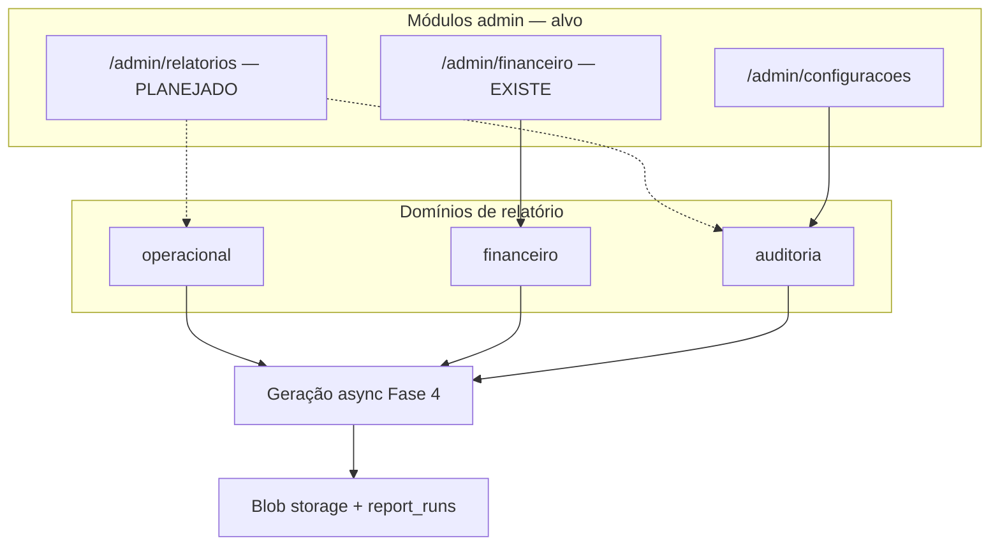

# OPERATIONAL_REPORTS_SPEC — Relatórios (Fase 2)

> **Status:** `[PLANEJADO]` — alinhado à realidade do código em 2026-05-28  
> **UI admin:** **inexistente** — apenas `ModuleKey: relatorios` em Configurações → permissões  
> **Contratos:** `lib/contracts/reports/` (catálogo alvo, sem mock de tela)  
> **Complementa:** `ENTITY_CATALOG.md` §13 · `BUSINESS_RULES.md` §12 · `AUDIT_LOG_SPEC.md`

---

## 1. Estado atual (evidência no código)

| Artefato | Existe? | Notas |
|----------|---------|-------|
| Rota `/admin/relatorios` | **Não** | Removida; não há página placeholder |
| Item na sidebar (`ADMIN_NAV`) | **Não** | Módulo reservado só em permissões |
| `ModuleKey: relatorios` | **Sim** | `lib/admin-settings-mocks.ts` — label "Relatórios" |
| Matriz permissões (admin/financeiro) | **Sim** | `PERMISSIONS_MATRIX.md` |
| Catálogo TypeScript operacional | **Sim** | `OPERATIONAL_REPORT_DEFINITIONS` — spec, não UI |
| Relatórios financeiros na UI | **Sim** | Aba **Relatórios** em `/admin/financeiro?tab=reports` |
| `report_runs` / jobs async | **Não** | Fase 4–5 |
| Export audit log | **Não** | Ver `AUDIT_LOG_SPEC.md` |

**Conclusão Fase 2:** documentar o **domínio alvo** e o que já existe no financeiro; **não** tratar relatórios operacionais como módulo implementado.

---

## 2. Objetivo de negócio (futuro)

Quando houver página admin, centralizar **relatórios operacionais** — ocupação, desempenho, frota — com exportação PDF/planilha e trilha de auditoria. Até lá, indicadores operacionais ficam nos módulos existentes (agenda, clientes, karts, dashboard).

---

## 3. Arquitetura alvo (dois níveis)

| Módulo | Escopo | Estado |
|--------|--------|--------|
| **Relatórios** (`relatorios`) | Operacional + auditoria | `[PLANEJADO]` — só ModuleKey |
| **Financeiro** (`financeiro`) | DRE, recebíveis, 8 relatórios financeiros | `[PARCIAL]` — aba Relatórios integrada (mock toast) |
| **Configurações** | Export audit log | `[PLANEJADO]` |

**Decisão Fase 2:** relatórios financeiros permanecem no módulo **financeiro**; a futura página `relatorios` agrega operacional + links para financeiro + audit export.

---

## 4. O que já funciona hoje (financeiro)

**Fonte:** `lib/admin-financial-mocks.ts` (`FINANCIAL_REPORTS`)

| ID | Label |
|----|-------|
| daily | Receita diária |
| monthly | Receita mensal |
| service | Receita por serviço |
| client | Receita por cliente |
| kart | Receita por kart |
| costs | Custos operacionais |
| delinq | Inadimplência |
| cashflow | Fluxo de caixa |

**UI:** aba **Relatórios** em `/admin/financeiro` (`?tab=reports`) — `financial-reports-section.tsx`; export → toast mock.

---

## 5. Catálogo operacional alvo (`[PLANEJADO]`)

Definido em `lib/contracts/reports/report-definitions.ts` — **sem tela**.

| ID | Label | Fonte de dados prevista |
|----|-------|-------------------------|
| track_occupancy | Ocupação da pista | agenda, bloqueios, grade |
| schedule_utilization | Utilização da agenda | eventos por tipo/status |
| pilot_performance | Desempenho de pilotos | sessões, telemetria, ranking |
| fleet_usage | Uso da frota | karts, manutenção |
| maintenance_summary | Resumo de manutenção | OS, checklists, peças |

---

## 6. Entidades (Fase 3+)

### `report_definitions`

Metadados estáticos (hoje: constantes TS). Futuro: DB para customização.

### `report_runs`

Execução assíncrona: período, `ReportRunStatus`, arquivo, usuário. Ver `STATE_MACHINES.md` §13.

---

## 7. Regras de negócio

| ID | Regra | Enforcement hoje |
|----|-------|------------------|
| BR-RPT-ACCESS | Operacional exige módulo `relatorios` | `[PLANEJADO]` |
| BR-RPT-FIN-LINK | Financeiros no módulo `financeiro` | UI parcial |
| BR-RPT-EXPORT | Export gera `report_run` + audit | `[PLANEJADO]` |
| BR-RPT-PERIOD | Período máx. 12 meses por run | `[INFERIDO]` |
| BR-RPT-PII | Menores: escopo responsável | `[PLANEJADO]` |

---

## 8. Permissões (`ModuleKey: relatorios`)

Matriz em `PERMISSIONS_MATRIX.md`. Enquanto não houver rota, permissão só afeta **atribuição em Configurações** (preparação para Fase 5).

| Ação (futura) | Admin | Financeiro |
|---------------|:-----:|:----------:|
| Ver catálogo operacional | V | V |
| Gerar export operacional | E | — |
| Export audit log | E | — |

---

## 9. UI alvo (quando implementar)

1. Criar rota `/admin/relatorios` e incluir em `ADMIN_NAV` se produto confirmar  
2. Abas: Operacional | Atalhos financeiros | Auditoria  
3. Cards por `ReportDefinitionDTO` + drawer de filtros  
4. Histórico `report_runs`  
5. Empty state honesto até backend existir  

---

## 10. Perguntas para stakeholder

1. Relatórios operacionais vs financeiros: página única ou financeiro self-contained?  
2. Prioridade dos 5 operacionais vs integrar os 8 financeiros primeiro?  
3. Staff operacional exporta dados de quais pilotos?  
4. Audit log em `relatorios` ou só `configuracoes`?  

---

## 11. Roadmap técnico

| Fase | Entrega |
|------|---------|
| **2** | Spec + contratos alvo ✅ (sem UI) |
| **1/4** | Integrar `financial-reports-section` em `/admin/financeiro` | ✅ aba Relatórios |
| **3** | Tabela `report_runs` |
| **4** | API + jobs async |
| **6** | Página `/admin/relatorios` + nav |

---

## Relacionados

- `ENTITY_CATALOG.md` §13  
- `BUSINESS_RULES.md` §12  
- `AUDIT_LOG_SPEC.md`  
- `STORAGE_STRATEGY.md` (Fase 3)
