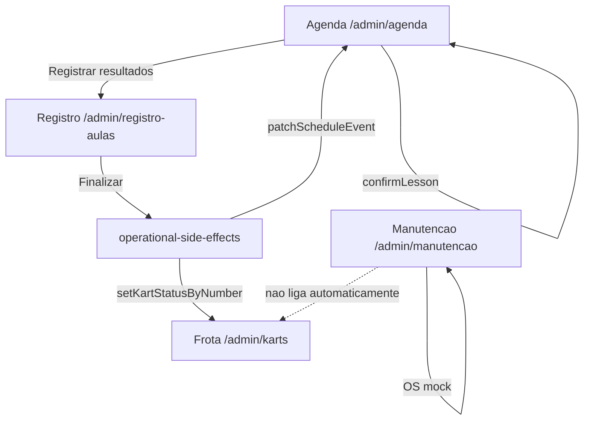
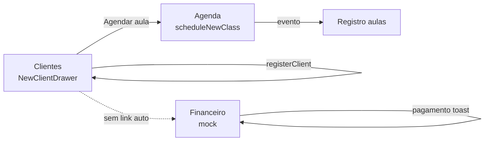

# OPERATIONAL_UX — Roteiros operacionais (Fase 1 / Sprint D)

> **Atualizado:** 2026-06-01  
> **Handoff HTTP:** [`MIGRATION_STATUS.md`](MIGRATION_STATUS.md)  
> **Pergunta-guia:** *"O Gurgel conseguiria operar isso rapidamente no dia a dia?"*

## Modos de operação

| Modo | Env | Persistência |
|------|-----|--------------|
| **Mock** (padrão) | `NEXT_PUBLIC_DATA_SOURCE=mock` | Stores in-memory — reload perde estado |
| **HTTP** | `NEXT_PUBLIC_DATA_SOURCE=http` + DB | PostgreSQL via Prisma — sobrevive reload |

**Correções P0 mock (2026-05-28):** nova aula, confirmar, finalizar registro, deep links, bloqueio kart.

**Agenda HTTP (2026-06-01):** eventos, bloqueios, remarcação, nova aula, swap kart, timeline da grade real, grade semanal em Configurações.

**Legenda:** ✅ funciona · ⚠️ parcial · ❌ ausente/mock

---

## Resumo executivo

| Fluxo | Veredicto | Bloqueio principal |
|-------|-----------|-------------------|
| Agenda → registro → kart liberado | ✅ **Demonstrável** | Modo http: agenda persiste; registro aulas UI ainda parcial mock |
| Cliente novo → pagamento → 1ª aula | ⚠️ **Parcial** | Clientes/agenda HTTP; pagamento toast/mock |
| Config grade → timeline agenda | ✅ **HTTP** | Salvar em Configurações → Horários reflete na agenda |

**Conclusão Fase 1:** a UI cobre telas e **encadeamento operacional P0** via stores de runtime (`schedule-runtime-store`, `clients-runtime-store`, `karts-runtime-store`, `operational-side-effects`). Fricções restantes (financeiro real, OS de manutenção, persistência entre sessões) alimentam **Fase 2** (`ENTITY_CATALOG.md`) e backend (Fases 5–6).

---

## Arquitetura de dados (contexto)

| Módulo | Fonte | Persistência cruzada |
|--------|-------|------------------------|
| Agenda | `ScheduleService` + `schedule-runtime-store` | Nova aula e confirmar aula **persistem em memória**; invalidam queries |
| Registro de aulas | `getMergedScheduleEvents()` + `lesson-registration-store` | Finalizar chama `finalizeLessonRegistrationSideEffects` → agenda + kart |
| Karts / manutenção | `karts-runtime-store` + mocks | Reserva/bloqueio operacional; liberação ao finalizar registro |
| Clientes | `clients-runtime-store` via `OperationalServiceMock.registerClient` | Novo cliente entra na lista e no modal de nova aula |
| Financeiro | `mockSaveRevenue`, drawers | Cobrança/pagamento só feedback **(mock)** — fora do escopo P0 |

Navegação contextual: drawer da agenda → **Confirmar aula**, **Registrar resultados** (deep link); perfil cliente → **Agendar aula**; bloqueio de kart impede agendamento/registro.

---

## Roteiro 1 — Agenda → confirmar aula → registrar → liberar kart

**Persona:** staff operacional / operador de pista no fim do turno.  
**Objetivo:** encerrar o dia com aulas registradas e karts liberados para o próximo turno.

### Passos

| # | Ação do operador | Rota / componente | Status | Notas |
|---|------------------|-------------------|--------|-------|
| 1 | Abrir agenda do dia | `/admin/agenda` → `SchedulePage` | ✅ | Timeline e visão semanal OK |
| 2 | Conferir eventos | `TimelineView` / `WeekView` | ✅ | Dados de `SCHEDULE_EVENTS` ou API |
| 3 | Criar nova aula | `ScheduleHeader` → `NewClassModal` | ✅ | `OperationalServiceMock.scheduleNewClass` + invalidação de queries |
| 4 | **Confirmar aula** | `ScheduleDetailsDrawer` | ✅ | Botão **Confirmar aula** → `confirmLesson` |
| 5 | Ir ao registro | Drawer → **Registrar resultados** ou sidebar | ✅ | Deep link com `scheduleEventId` |
| 6 | Localizar sessão | `LessonSessionList` + filtros | ✅ | Sessões derivadas de `getMergedScheduleEvents()` |
| 7 | Registrar resultados | `LessonSessionWorkspace` | ⚠️ | OCR / telemetria / manual; OCR exige OpenAI |
| 8 | Finalizar registro | Botão “Finalizar registro” | ✅ | `finalizeLessonRegistrationSideEffects` → agenda `finalizado` |
| 9 | Liberar kart | Automático + `/admin/karts` | ✅ | Kart `em_treino`/`reservado` → `disponivel` (se não bloqueado) |

### Diagrama do fluxo (estado atual)



### Detalhes técnicos relevantes

**Criação de aula** — `components/admin/schedule/new-class/new-class-modal.tsx`:

- Alunos incluem clientes de `clients-runtime-store` (cadastros da sessão).
- `OperationalServiceMock.scheduleNewClass` persiste evento e invalida `queryKeys.schedule.events`.

**Finalizar registro** — `lib/operational-side-effects.ts`:

```ts
patchScheduleEvent(session.scheduleEventId, { status: "finalizado" });
setKartStatusByNumber(session.kartNumber, "disponivel"); // se aplicável
```

**Kart bloqueado vs treino:**

- `isKartBlockedForOperation` impede agendamento (`reserveKartForScheduleEvent`) e bloqueia workspace de registro quando kart em manutenção.

### OCR — passos e tempo estimado

| Fase | Ações | Status |
|------|-------|--------|
| Escolher método | OCR na workspace | ✅ |
| Upload | Foto → `POST /api/admin/lesson-registration/ocr` | ⚠️ 503 se `OPENAI_API_KEY` ausente |
| Revisão | Confirmar tempos / ajustar voltas | ✅ |
| Notas Gurgel | Preencher feedback operacional | ✅ |
| Finalizar | Botão “Finalizar registro” | ✅ |

**Estimativa UI:** ~4–5 cliques + upload; **meta < 2 min** só atingível com API OCR configurada e foto legível. Fallback em erro OCR preenche voltas default — copy “Tempos conferidos” pode parecer sucesso quando houve falha.

### Fricções — Roteiro 1

| P | Fricção | Status | Impacto operacional |
|---|---------|--------|---------------------|
| P0 | Passo “confirmar aula” inexistente | ✅ resolvido | — |
| P0 | Nova aula não persiste | ✅ resolvido (memória) | Perde ao recarregar página |
| P0 | Finalizar registro ≠ liberar kart | ✅ resolvido | OS de manutenção ainda mock |
| P1 | Sem deep link agenda ↔ registro | ✅ resolvido | — |
| P1 | Kart 12: treino + manutenção simultâneos | ⚠️ aberto | Dados demo; enforcement parcial |
| P2 | OCR depende de env externo | ⚠️ aberto | Turno sem chave = manual/telemetria |
| P2 | `schedule-page` nav local reduzida | ⚠️ aberto | Callbacks internos |

---

## Roteiro 2 — Cliente novo → agendar → pagamento → primeira aula

**Persona:** recepção / comercial no onboarding de piloto novo.  
**Objetivo:** cadastrar, cobrar e colocar o piloto na pista no mesmo dia ou na semana.

### Passos

| # | Ação do operador | Rota / componente | Status | Notas |
|---|------------------|-------------------|--------|-------|
| 1 | Cadastrar cliente | `/admin/clientes` → `NewClientDrawer` | ✅ | `ClientsServiceMock.registerClient` → runtime store |
| 2 | Ver cliente na lista | `ClientTable` / `ClientMobileList` | ✅ | `onSuccess` invalida lista |
| 3 | Agendar primeira aula | Perfil → **Agendar aula** | ✅ | Abre fluxo de nova aula com cliente |
| 4 | Nova aula pelo modal | `NewClassModal` | ✅ | Cliente recém-cadastrado disponível na lista |
| 5 | Registrar cobrança | `/admin/financeiro` → `NewRevenueDrawer` | ⚠️ | Wizard OK; origem “agendamento” parcialmente ligada |
| 6 | Registrar pagamento | `PaymentDrawer` | ⚠️ | Toast **(mock)**; recebível não muda de status |
| 7 | Cliente na agenda | Timeline | ✅ | Evento criado no passo 4 |
| 8 | Primeira aula — registro | `/admin/registro-aulas` | ✅ | Sessão derivada do evento criado |

### Diagrama do fluxo (estado atual)



### Detalhes técnicos relevantes

**Novo cliente** — `components/admin/clients/new-client-drawer.tsx` + `clients-page.tsx`:

- `handleSubmit` chama `onSuccess` → `ClientsServiceMock.registerClient` → lista atualizada.

**Ações rápidas do perfil** — `profile-quick-actions-footer.tsx`:

- **Agendar aula** navega/abre fluxo quando `onScheduleClass` é passado pelo drawer.

**Financeiro** (ainda mock):

- `mockSaveRevenue` não altera lista de recebíveis; pagamento só toast.

### Fricções — Roteiro 2

| P | Fricção | Status | Impacto operacional |
|---|---------|--------|---------------------|
| P0 | Cadastro não persiste na lista | ✅ resolvido (memória) | Perde ao recarregar |
| P0 | Sem encadeamento cadastro → agenda | ✅ resolvido | Cobrança ainda manual |
| P1 | Ações rápidas do perfil mortas | ⚠️ parcial | Agendar OK; feedback/resultado pendentes |
| P1 | Cobrança por agendamento só IDs mock | ⚠️ aberto | Fase 2 / financeiro |
| P2 | Pagamento só toast | ⚠️ aberto | Contas a receber estáticas |
| P2 | Sem CTA pós-cadastro (“Cobrar”) | ⚠️ aberto | Operador vai ao financeiro manualmente |

---

## Roteiro transversal — Manutenção bloqueando kart

| Mecanismo | Onde | Efeito real | Liga com registro? |
|-----------|------|-------------|-------------------|
| Evento `manutencao` na agenda | `SCHEDULE_EVENTS` | Excluído de `getLessonSessionsFromSchedule` | ✅ correto |
| Badge `bloqueado_checklist` no drawer | `schedule-details-drawer.tsx` | Visual + enforcement parcial | ⚠️ registro bloqueado se kart em manutenção |
| OS nova “bloquear kart” | `new-maintenance-modal.tsx` | Toast **(mock)** | ❌ não atualiza frota automaticamente |
| Inspeção / checklist “Liberar” | modais manutenção | Toast **(mock)** | ❌ não atualiza frota |

**Conclusão:** bloqueio operacional via `karts-runtime-store` **enforce** agendamento/registro; manutenção/OS ainda narrativa até backend.

---

## Mapa de navegação admin (links contextuais)

| De → Para | Existe? | Observação |
|-----------|---------|------------|
| Agenda → Registro (mesma aula) | ✅ | **Registrar resultados** no drawer |
| Registro → Agenda | ⚠️ | Nav shell genérica |
| Registro → Kart da sessão | ❌ | Sem contexto |
| Finalizar registro → Liberar kart | ✅ | Side effect automático |
| Perfil cliente → Agenda | ✅ | **Agendar aula** |
| Perfil cliente → Financeiro | ❌ | `FinancialSummary` só leitura |
| Agenda detalhe → Registrar pagamento | ❌ | Badge sem ação |

---

## Recomendações — Fase 2+

Priorizadas para fechar o gap “demonstrável em memória → operacional com backend”:

1. **Entidade única de sessão** — formalizar em `ENTITY_CATALOG.md` e `STATE_MACHINES.md`.
2. ~~**Persistir create** — nova aula e novo cliente~~ ✅ mock runtime; **migrar para API/DB** na Fase 5.
3. ~~**Side effects ao finalizar registro**~~ ✅ mock; persistir transações na Fase 5.
4. ~~**UI contextual** — confirmar, registrar, agendar~~ ✅ Fase 1; adicionar **Registrar pagamento** na Fase 2.
5. **Pós-cadastro cliente** — CTA “Gerar cobrança” + link financeiro.
6. **Manutenção/OS** — bloquear kart via OS real, não só runtime store.
7. **Financeiro** — recebíveis e pagamentos ligados a `schedule_event_id` e `client_id`.

---

## Critérios de aceite — “operacionalmente fechado”

Marque quando **todos** forem verdadeiros (alvo pós-backend; mock Fase 1 cobre os itens ~~riscados~~):

- [x] ~~Nova aula aparece na agenda e no registro em < 5 s~~ (mock runtime; reload perde estado)
- [x] ~~Confirmar aula altera status visível na agenda e na lista de registro~~
- [x] ~~Finalizar registro marca agenda como finalizada e libera kart~~
- [x] ~~Kart em manutenção impede agendamento e registro de treino no mesmo número~~
- [x] ~~Cliente novo aparece na lista, no modal de nova aula~~
- [ ] Cliente novo pode ser cobrado com origem correta (evento recém-criado)
- [ ] Pagamento registrado reflete no badge financeiro da agenda e no perfil do cliente
- [ ] OCR completo (upload → revisão → finalizar) em **< 2 min** com API configurada
- [x] ~~Operador percorre Roteiro 1 sem trocar de contexto mental~~ (deep links agenda ↔ registro)
- [ ] Roteiro 2 completo inclui cobrança + pagamento sem módulo financeiro mock

---

## Arquivos de referência

| Área | Caminhos |
|------|----------|
| Páginas | `app/admin/agenda`, `registro-aulas`, `clientes`, `financeiro`, `karts`, `manutencao` |
| Agenda | `components/admin/schedule-page.tsx`, `schedule/schedule-details-drawer.tsx`, `schedule/new-class/new-class-modal.tsx` |
| Registro | `components/admin/lesson-registration/lesson-registration-page.tsx`, `lesson-session-workspace.tsx` |
| Store / side effects | `lib/schedule-runtime-store.ts`, `clients-runtime-store.ts`, `karts-runtime-store.ts`, `operational-side-effects.ts`, `services/operational/operationalServiceMock.ts` |
| Clientes | `components/admin/clients/new-client-drawer.tsx`, `clients/profile-quick-actions-footer.tsx` |
| Manutenção | `components/admin/maintenance/simple/`, `maintenance/new-maintenance/`, `checklist/` |
| OCR | `app/api/admin/lesson-registration/ocr/route.ts`, `lib/lesson-registration-ocr.ts` |

---

## Relacionados

- `docs/PRE_BACKEND_FLOW.md` — etapa 11 (este documento)
- `docs/PHASE1_PAGE_AUDIT.md` — Sprint D + E (fechamento Fase 1)
- `docs/PRE_BACKEND_FLOW.md` — critérios de saída Fase 1
