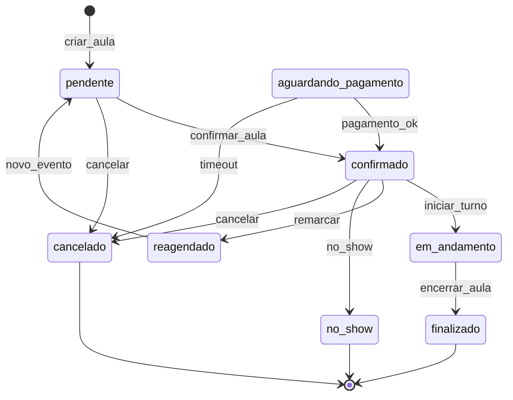
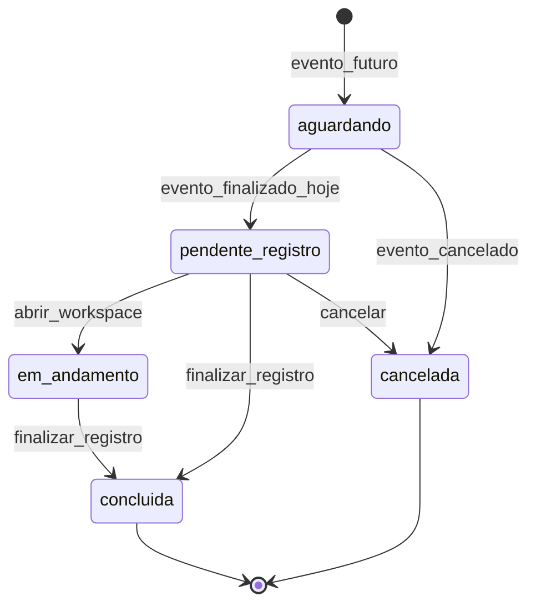
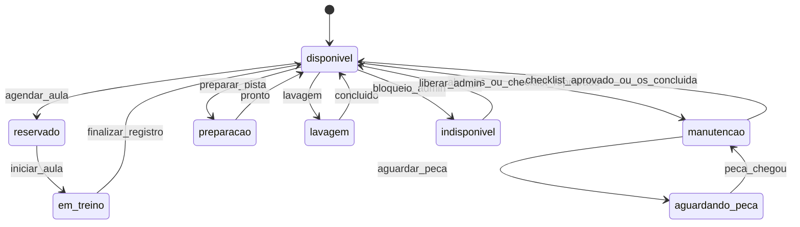
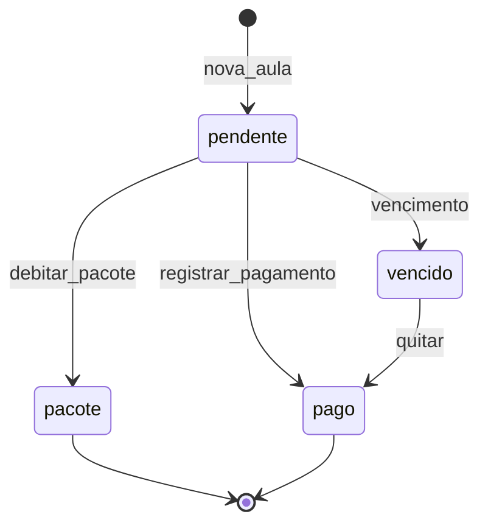
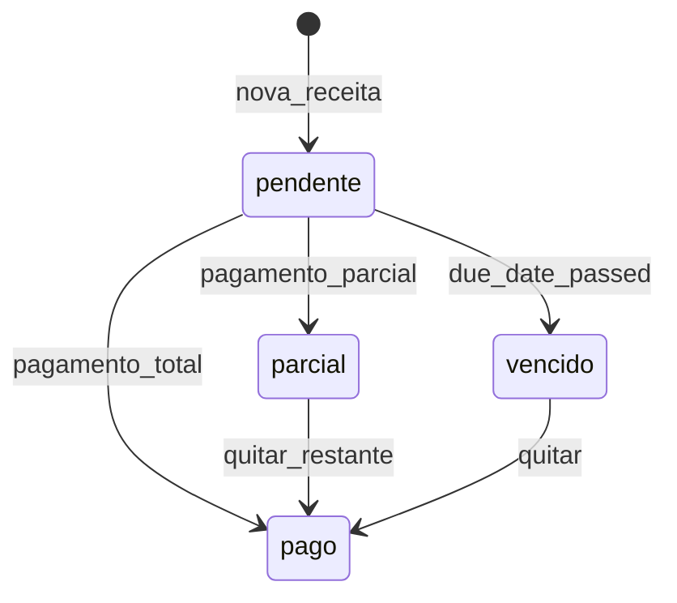
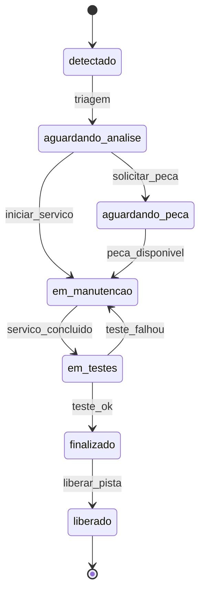
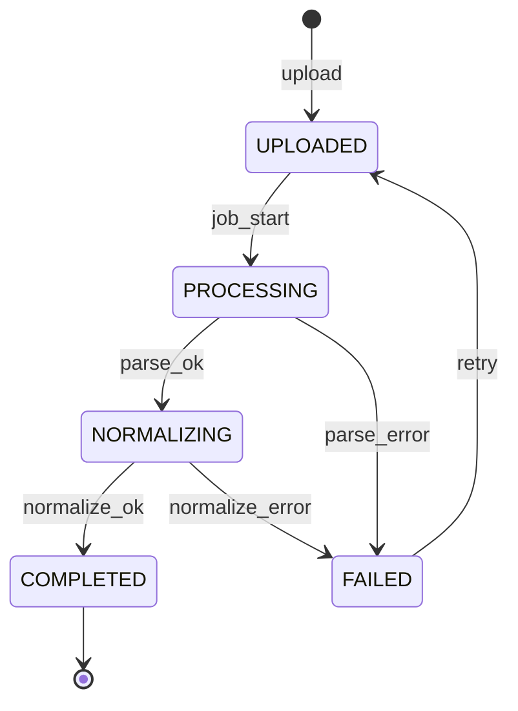
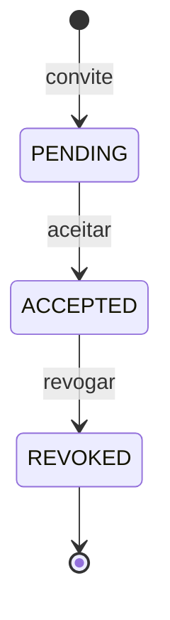
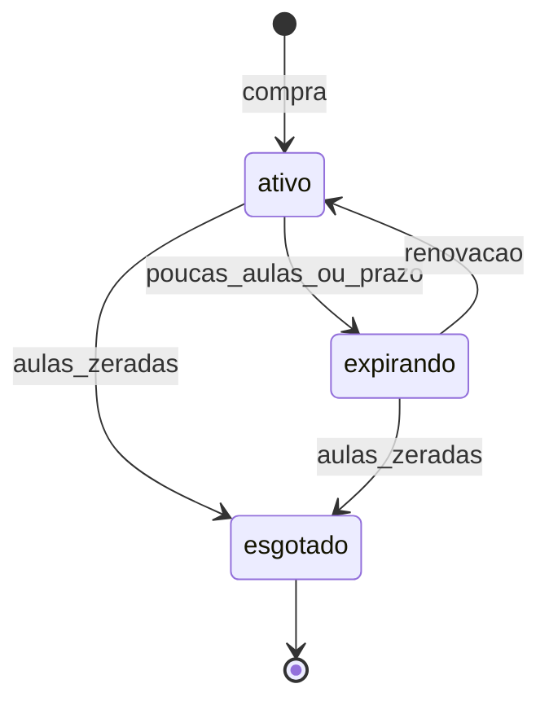
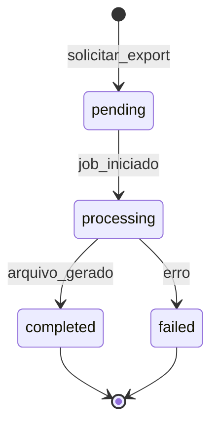

# STATE_MACHINES — Máquinas de estado (Fase 2)

> **Status:** `[CONFIRMADO]` — 2026-05-28  
> **Enums existentes:** `lib/contracts/enums.ts`  
> **Alvo Fase 3:** enums PostgreSQL + CHECK constraints ou tabelas de transição

---

## Convenções

- **Estado inicial** em negrito na diagrama
- Transições anotadas com evento/ação
- Side effects referenciam regra `BR-*` em `BUSINESS_RULES.md`
- `[MOCK]` = implementado em runtime store; `[UI]` = só visual

---

## 1. Schedule event (`schedule_events`)

**Enum:** `ScheduleEventStatus`  
**Valores:** `pendente`, `confirmado`, `em_andamento`, `finalizado`, `cancelado`, `reagendado`, `no_show`, `aguardando_pagamento`

| Transição | Side effect | Enforcement |
|-----------|-------------|-------------|
| → confirmado | Reserva kart `[MOCK]` | `operational-side-effects` |
| → finalizado | Sessão `pendente_registro` | `lesson-registration-mocks` |
| → cancelado | Libera kart se reservado | `[PLANEJADO]` |

**Fonte:** `lib/admin-schedule-mocks.ts`, `schedule-runtime-store.ts`

---

## 2. Lesson session (`lesson_sessions`)

**Enum:** `LessonStatus` / `LessonStatus` enum TS  
**Valores:** `aguardando`, `pendente_registro`, `em_andamento`, `concluida`, `cancelada`

| Transição | Side effect | Regra |
|-----------|-------------|-------|
| → concluida | Evento `finalizado`; kart `disponivel` | `BR-LES-FINISH` `[MOCK]` |
| abrir workspace | Bloqueia se kart manutenção | `BR-KART-BLOCK` `[MOCK]` |

**Fonte:** `lib/lesson-registration-store.ts`, `lib/operational-side-effects.ts`

---

## 3. Kart (`karts`)

**Enum:** `KartStatus`  
**Valores:** `disponivel`, `em_treino`, `reservado`, `manutencao`, `aguardando_peca`, `indisponivel`, `preparacao`, `lavagem`

**Bloqueio operacional:** `manutencao`, `aguardando_peca`, `indisponivel` → impede agendamento/registro.

**Fonte:** `lib/karts-runtime-store.ts`, manutenção simple/completa

---

## 4. Payment on event (`schedule_events.payment_status`)

**Enum:** `PaymentStatus`  
**Valores:** `pago`, `pendente`, `vencido`, `pacote`

**Fonte:** `finance-runtime-store.ts` + drawer agenda `[MOCK]`

---

## 5. Account receivable (`accounts_receivable`)

**Enum:** `ReceivableStatus`  
**Valores:** `pendente`, `pago`, `vencido`, `parcial`

**Fonte:** `lib/finance-runtime-store.ts`

---

## 6. Maintenance order — fluxo completo (`maintenance_orders`)

**Enum:** `MaintenanceStatus` (OS legada)  
**Valores:** `detectado` → `aguardando_analise` → `aguardando_peca` → `em_manutencao` → `em_testes` → `finalizado` → `liberado`

---

## 7. Simple maintenance (`simple_maintenances`)

**Enum:** `SimpleMaintenanceStatus`  
**Valores:** `pendente`, `em_andamento`, `concluida`

Side effect mock: ≠ concluida → kart `manutencao`; concluida → `disponivel`.

---

## 8. Complete checklist (`complete_checklists`)

**Enum:** `ChecklistFinalStatus`  
**Valores:** `aprovado`, `aprovado_ressalvas`, `reprovado`

| Resultado | Kart |
|-----------|------|
| aprovado / aprovado_ressalvas | disponivel |
| reprovado | manutencao (+ OS drafts opcionais) |

---

## 9. Telemetry session (`telemetry_sessions`)

**Enum:** `TelemetryStatus` (`lib/contracts/enums.ts`)

**Regra:** voltas inválidas excluídas de stats — `BR-TEL-INVALID`

---

## 10. Consent (`consents`)

**Enum:** `ConsentStatus`

**Side effect revogação imagem:** bloqueio operacional `[PLANEJADO]`

---

## 11. Package credits (`packages`)

**Enum:** `PackageStatus` — `ativo`, `expirando`, `esgotado`

---

## 12. Purchase order (`purchase_orders`)

**Enum:** `solicitado` → `aprovado` → `comprado` → `entregue`

---

## 13. Report run (`report_runs`)

**Enum:** `ReportRunStatus`  
**Spec:** `OPERATIONAL_REPORTS_SPEC.md`  
**Nota:** máquina alvo Fase 4–5; módulo admin `relatorios` ainda **sem página**.

| Transição | Side effect | Regra |
|-----------|-------------|-------|
| → completed | URL blob + audit | `BR-RPT-EXPORT` |

---

## Matriz transição × enforcement

| Máquina | UI | Runtime mock | API | DB constraint |
|---------|:--:|:------------:|:---:|:-------------:|
| schedule_event | ✓ | ✓ | parcial | — |
| lesson_session | ✓ | ✓ | — | — |
| kart | ✓ | ✓ | — | — |
| receivable | ✓ | ✓ | — | — |
| telemetry | ✓ | local | — | — |
| maintenance OS | ✓ | parcial | — | — |
| report_run | — | — | — | — |

---

## Próximos passos (Fase 3)

1. Materializar enums PostgreSQL + CHECK constraints (incl. report_runs).
2. Tabela `state_transitions` opcional para auditoria.
3. Validar transições inválidas na API (409 Conflict).

---

## Relacionados

- `ENTITY_CATALOG.md` — entidades  
- `BUSINESS_RULES.md` — regras por transição  
- `OPERATIONAL_UX.md` — fluxos validados
