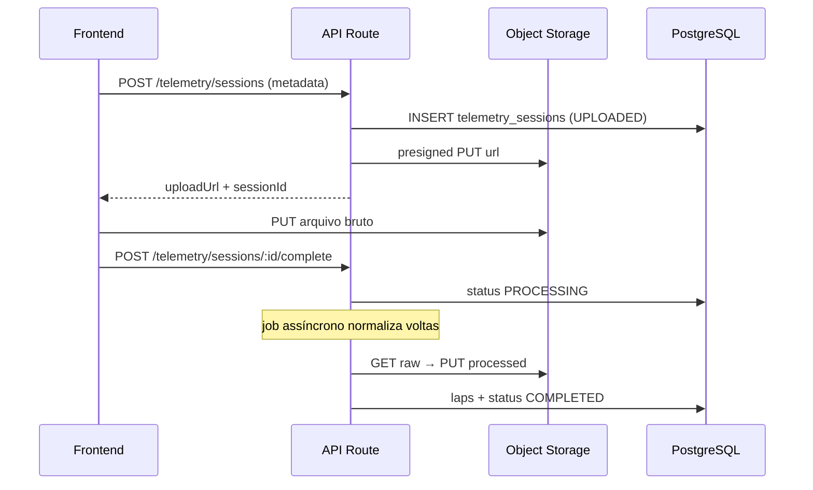

# STORAGE_STRATEGY — Gurgel Team

> **Última atualização:** 2026-05-28  
> **Fase:** 3 (v1 confirmado — 2026-05-28)  
> **Escopo:** onde persistir arquivos binários e exports; metadados ficam no PostgreSQL (`prisma/schema.prisma`).

---

## 1. Princípios

| Princípio | Decisão |
|-----------|---------|
| Metadados | PostgreSQL (Prisma) — IDs, status, hashes, FKs |
| Blobs | Object storage (S3-compatible) — não no banco |
| Ambiente dev | Disco local ou MinIO em Docker |
| Ambiente prod | AWS S3 ou Cloudflare R2 (compatível S3 API) |
| URLs públicas | Signed URLs com TTL curto (15–60 min) |
| URLs privadas | Nunca expor bucket; sempre via API + assinatura |

**Variáveis de ambiente (Fase 5):**

```env
STORAGE_PROVIDER=s3          # s3 | local
STORAGE_BUCKET=gurgel-team
STORAGE_REGION=sa-east-1
STORAGE_ENDPOINT=            # vazio na AWS; http://localhost:9000 no MinIO
STORAGE_ACCESS_KEY=
STORAGE_SECRET_KEY=
STORAGE_PUBLIC_BASE_URL=     # CDN opcional
```

---

## 2. Mapa por tipo de arquivo

| Tipo | Exemplos | Onde (blob) | Metadados (DB) | Retenção | Acesso |
|------|----------|-------------|----------------|----------|--------|
| Avatar piloto | `avatar.jpg` | `avatars/{clientId}/{uuid}.webp` | `clients.avatar_url` | Indefinida enquanto ativo | Piloto próprio; admin recepção |
| Logo organização | `logo.png` | `org/logo.webp` | `organization_settings.logo_url` | Indefinida | Público (site) |
| Telemetria bruta | `.mp4`, `.360`, CSV GoPro | `telemetry/raw/{sessionId}/{filename}` | `telemetry_sessions.raw_file_key` | 24 meses | Piloto da sessão; staff; admin |
| Telemetria processada | JSON normalizado | `telemetry/processed/{sessionId}.json` | derivado de `telemetry_sessions` | 24 meses | Mesmo que bruta |
| Export relatório | PDF, XLSX, CSV | `reports/{runId}.{ext}` | `report_runs.file_key` | 90 dias | Quem gerou + perfis com `relatorios.canView` |
| OCR planilha | foto S1/S2/S3 | `lessons/ocr/{lessonSessionId}/{uuid}.jpg` | `audit_logs` + metadata JSON | 12 meses | Staff operacional; admin |
| Documentos menor | autorização, RG scan | `guardians/{guardianId}/docs/{uuid}.pdf` | `guardian_links` flags + audit | 5 anos (LGPD) | Admin; responsável vinculado |
| Vídeo material | treino, briefing | `media/videos/{slug}.mp4` | futuro `video_materials` (P2) | Indefinida | Conforme módulo |

---

## 3. Convenção de keys

```
{domínio}/{entidadeId}/{opcional-subpasta}/{uuid}.{ext}
```

- Sem PII no path (usar UUIDs, não CPF/nome).
- Content-Type explícito no upload.
- Hash SHA-256 do arquivo registrado em `audit_logs.metadata` em uploads sensíveis.

**Exemplo telemetria:**

```
telemetry/raw/550e8400-e29b-41d4-a716-446655440000/HERO11_001.MP4
telemetry/processed/550e8400-e29b-41d4-a716-446655440000/laps.json
```

---

## 4. Fluxos principais

### 4.1 Upload telemetria (Fase 5+)



### 4.2 Export relatório financeiro

1. UI solicita geração → `report_runs` com `status=pending`.
2. Job gera arquivo → grava em `reports/{runId}.pdf`.
3. Atualiza `file_key`, `status=completed`, `completed_at`.
4. Download via signed URL; expira após TTL.

### 4.3 Avatar

1. Resize/WebP no servidor (max 512px).
2. Substitui key anterior; invalida CDN se houver.
3. Atualiza `clients.avatar_url` com path relativo ou URL assinável.

---

## 5. Segurança e LGPD

| Regra | Implementação |
|-------|----------------|
| Consentimento imagem | `consents` type `image`; revogação bloqueia exibição pública (BR-* em `BUSINESS_RULES.md`) |
| Menores | Documentos em prefixo `guardians/` — bucket privado, sem listagem |
| Exclusão | Soft-delete metadados + lifecycle rule S3 (expiração por prefixo) |
| Auditoria | Upload/download sensível → `audit_logs` com `action`, `entity_type`, hash |
| Criptografia | SSE-S3 ou SSE-KMS em produção |

---

## 6. Desenvolvimento local

| Opção | Quando usar |
|-------|-------------|
| `STORAGE_PROVIDER=local` | Sem Docker; arquivos em `./storage/` (gitignored) |
| MinIO | Paridade com S3; `docker compose up minio` (Fase 5) |

`.gitignore` deve incluir `/storage/` e uploads temporários.

---

## 7. Fora do escopo desta fase

- CDN e cache invalidation automatizada
- Transcoding de vídeo (ffmpeg jobs)
- Backup cross-region
- `video_materials` e gamificação (P2)

---

## 8. Referências

- `prisma/schema.prisma` — `raw_file_key`, `file_key`, `avatar_url`
- `docs/AUDIT_LOG_SPEC.md` — eventos de upload
- `docs/OPERATIONAL_REPORTS_SPEC.md` — relatórios financeiros
- `docs/PRE_BACKEND_FLOW.md` — Fase 3 critérios de saída
